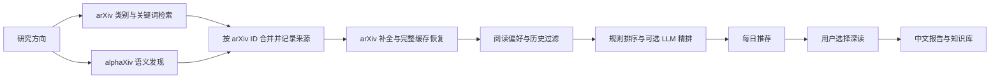

<p align="center">
  
</p>

<h1 align="center">PaperLoom · 知织</h1>

<p align="center">
  <strong>把论文织成知识。</strong><br>
  Weave papers into understanding.<br>
  面向研究者的本地优先论文助手，提供个性化推荐、中文阅读报告和持续研究记录。
</p>

<p align="center">
  
  <a href="LICENSE"></a>
  
</p>

<p align="center">
  <a href="#quick-start">快速开始</a> ·
  <a href="#discovery">协作检索</a> ·
  <a href="#configuration">配置</a> ·
  <a href="#integrations">集成</a> ·
  <a href="#faq">常见问题</a> ·
  <a href="#development">参与开发</a>
</p>

---

PaperLoom 把论文发现、筛选、阅读和归档放在同一个工作流中：**arXiv 提供类别与关键词检索，alphaXiv 补充语义发现；你决定深读哪些论文，系统再生成报告并连接到 Zotero 或 Obsidian。**

项目提供本地 Web 界面与 CLI，研究方向、阅读偏好和生成文件保存在你控制的目录中。可以只使用基础检索，也可以逐步接入模型、语义发现与知识库。当前包版本为 **1.3.0**；参见 [变更记录](CHANGELOG.md)、[版本说明](RELEASE_NOTES_v1.3.0.md) 与 [近期架构改进](docs/ARCHITECTURE_IMPROVEMENTS_2026-09-16.md)。

PaperLoom 原名 arXiv Research Assistant。推荐使用新命令 `paperloom`，旧命令 `arxiv-ra` 继续可用；Python 发行包名 `arxiv-research-assistant` 与模块名 `arxiv_ra` 保留用于兼容升级。已有安装重新执行 `python -m pip install -e ".[gui]"` 后即可获得新命令，原有配置、研究方向和产物目录无需改名。

## 能做什么

| 能力 | 使用方式 |
| --- | --- |
| **围绕研究方向发现论文** | 按类别、时间范围和关键词检索，结合 alphaXiv 语义候选、规则评分与可选 LLM 精排 |
| **建立可解释的阅读偏好** | 收藏作为正样本，“不相关”作为负样本；按方向隔离，并保留每日推荐历史 |
| **按需生成中文阅读报告** | 提取论文正文、方法图与公式说明，输出 Markdown、HTML 和元数据 |
| **保留证据与版本信息** | 记录发现来源、补全状态及出版信息核验结果；区分历史快照、最新查询和指定版本 |
| **持续跟进一个主题** | 生成研究周报、追踪 arXiv 修订版本、浏览相关工作地图 |
| **连接已有研究工具** | 保存到 Zotero、同步到 Obsidian、通过 SMTP 投递日报，或由本地计划任务定时执行 |

适合希望持续跟进若干研究主题、用中文辅助阅读、并保留本地成果的个人研究者。Web 界面面向本机使用，不提供多用户账户与公网访问认证。

<a id="quick-start"></a>
## 快速开始

### 1. 安装

需要 **Python 3.11+**。从 [Releases](https://github.com/Dennis-Huangm/PaperLoom/releases/latest) 下载源码包，或克隆仓库：

```bash
git clone https://github.com/Dennis-Huangm/PaperLoom.git
cd PaperLoom
```

然后在包含 `pyproject.toml` 的项目根目录执行以下安装命令。

**Windows / PowerShell**

```powershell
py -3 -m venv .venv
.\.venv\Scripts\Activate.ps1
python -m pip install -e ".[gui]"
python -m pip install tzdata

if (-not (Test-Path config.yaml)) { Copy-Item config.example.yaml config.yaml }
if (-not (Test-Path .env)) { Copy-Item .env.example .env }
```

Windows 安装步骤额外补充 `tzdata`，供 Python 解析 `Asia/Shanghai` 等 IANA 时区。参见 [Python 时区数据说明](https://docs.python.org/3.12/library/zoneinfo.html#data-sources)。

如果 PowerShell 不允许激活脚本，可以直接使用 `.\.venv\Scripts\python.exe -m pip ...` 安装，再通过 `.\.venv\Scripts\paperloom.exe` 运行命令，无需修改系统执行策略。

<details>
<summary>Linux / macOS / Bash 安装命令</summary>

```bash
python3 -m venv .venv
source .venv/bin/activate
python -m pip install -e '.[gui]'

[ -f config.yaml ] || cp config.example.yaml config.yaml
[ -f .env ] || cp .env.example .env
```

Windows 的 GUI 启动脚本和计划任务脚本仅用于 Windows；其他环境使用下方的通用 CLI 命令。

</details>

仅使用 CLI 时可安装 `python -m pip install -e .`。默认 PDF 解析器为 PyMuPDF；需要尝试 Docling 时，可安装 `python -m pip install -e ".[gui,docling]"`。Docling 是可选依赖，未安装时仍可生成报告。

### 2. 先体验，再接入服务

```bash
# 检查配置、模型环境变量和可选组件
paperloom --config config.yaml doctor

# 完全离线的示例日报，不请求外部服务、不调用模型、不发送邮件
paperloom --config config.yaml demo

# 启动本地界面
paperloom --config config.yaml gui
```

浏览器会打开 **http://127.0.0.1:8000**。也可使用 `gui --port 8001 --no-browser` 自定义端口并关闭自动打开浏览器。

`doctor` 是本地配置检查，不代表外部 API 已连通。`demo` 会在配置的输出目录写入示例文件；已有研究数据时，应使用独立的 `output_dir` 体验示例。

### 3. 创建方向，获取真实推荐

1. 在“方向”页面填写主题名称、具体关键词和／或参考论文 arXiv ID。
2. 在“配置”页面选择检索模式、填写可选服务凭据，并设置模型名称。
3. 首次联网运行建议只刷新本地推荐，确认结果后再启用邮件和自动同步。

```bash
paperloom --config config.yaml run --no-email
```

示例配置启用了邮件投递、自动周报和自动版本检查。若希望先单独体验论文推荐，可将以下字段合并到 `config.yaml` 对应段中：

```yaml
delivery:
  email_enabled: false
weekly:
  auto_generate: false
version_tracking:
  auto_check: false
```

不配置 LLM 也能体验基础检索、规则排序和回退报告。高质量中文摘要、精排、全文综合与图示解读需要相应模型能力。

<a id="discovery"></a>
## arXiv 与 alphaXiv 如何协作



上图对应 `hybrid` 模式。三种模式的区别是：

| `discovery.provider` | 行为 |
| --- | --- |
| `hybrid` | 每次尝试两路发现，合并去重后补全；alphaXiv 主动扩展候选集 |
| `arxiv` | 仅使用 arXiv，适合没有 alphaXiv 凭据的环境 |
| `auto` | 兼容旧行为：仅在 arXiv 检索失败后调用 alphaXiv |

启用协作检索时，在 `.env` 中填写 `ALPHAXIV_API_KEY`，并在**当前研究方向**的 `discovery` 段设置：

```yaml
discovery:
  provider: hybrid
  alphaxiv_fallback_enabled: true
  alphaxiv_max_candidates: 15
  alphaxiv_minimum_concept_groups: 1
```

`alphaxiv_fallback_enabled` 沿用了旧配置名称，现在同时控制 `hybrid` 与 `auto` 中的 alphaXiv 开关。本项目的 alphaXiv 候选上限为 15，与 arXiv 候选上限独立。API 的可用性、额度和费用以服务提供方为准。

**失败时保留可用信息。** 单路失败时仍处理另一来源的结果；arXiv 补全失败时优先复用完整本地缓存。摘要预览与未核实信息不会伪装成完整元数据，也不会把未知发布日期填成今天。两路都失败时保留已发布推荐；同日没有符合条件的新论文时，也保留已有推荐。

每次发现的来源状态、耗时与补全计数写入 `discovery-<profile>-<run-id>.json`，便于区分网络失败、空结果和筛选后无候选。

<a id="configuration"></a>
## 配置与研究方向

### 配置放在哪里

| 文件 | 职责 |
| --- | --- |
| `config.yaml` | 模型、输出目录、PDF、邮件、集成、任务并行数等全局设置 |
| `.env` | API 密钥、服务地址和 SMTP 凭据；从配置文件所在目录加载 |
| `profiles/<id>.yaml` | 某个研究方向的检索与排序配置 |
| `profiles/active.txt` | 当前启用的研究方向 |

首次运行时会为尚无方向档案的项目建立默认方向。**活动方向的 `discovery` 和 `ranking` 段会覆盖全局同名段**；已有方向后，只修改 `config.yaml` 的检索字段可能不会生效。推荐通过 GUI 修改，或编辑当前方向的 YAML。完整字段见 [配置模板](config.example.yaml) 和 [环境变量模板](.env.example)。

```bash
paperloom --config config.yaml profiles
paperloom --config config.yaml activate your-profile-id
```

关键词宜描述具体任务、方法和模态。负向关键词用于降低得分；用户标记“不相关”产生的负反馈还会参与候选过滤。收藏与“不相关”互斥，正向偏好学习仅取当前方向最近收藏的 30 篇论文。

后台任务使用**提交时的配置和研究方向**。切换方向或修改设置影响后续提交，不改变已排队任务。GUI 并行数通过 `jobs.max_parallel` 调整，范围为 1–8，默认 3。

### 模型与外部服务

项目使用 OpenAI-compatible Chat Completions，可接入兼容的远程服务或本地端点。将 `.env` 中的 `LLM_API_KEY`、`LLM_BASE_URL` 与 `config.yaml` 中的 `llm.model` 配套设置；模型名应以实际服务可用的名称为准。

```dotenv
# 远程兼容服务；使用 SDK 默认服务地址时可留空 BASE_URL
LLM_API_KEY=your-api-key
LLM_BASE_URL=

# 按需填写
ALPHAXIV_API_KEY=
OPENALEX_API_KEY=
SEMANTIC_SCHOLAR_API_KEY=
```

本地 Ollama 可将 `LLM_BASE_URL` 设为 `http://localhost:11434/v1`、`LLM_API_KEY` 设为 `ollama`，并将 `llm.model` 设为本机已准备的模型名。图示解读还需要模型支持图像输入，普通文本模型无法替代视觉能力。

OpenAlex 与 Semantic Scholar 用于出版信息核验；未配置凭据或请求失败时，能否返回结果取决于服务端策略。请将 `metadata.openalex_email` 改为自己的联系邮箱。不要将 `.env` 或真实凭据提交到仓库。

## 日常使用

下面的命令都从项目根目录执行；若配置文件不在根目录，请用 `--config` 指定路径。

| 目标 | 命令 |
| --- | --- |
| 启动界面 | `paperloom --config config.yaml gui` |
| 生成推荐并按配置投递 | `paperloom --config config.yaml run` |
| 生成推荐、不发邮件 | `paperloom --config config.yaml run --no-email` |
| 忽略已处理历史，重新筛选 | `paperloom --config config.yaml run --force --no-email` |
| 阅读一篇论文的当前版本 | `paperloom --config config.yaml report 2407.05600` |
| 阅读指定修订版 | `paperloom --config config.yaml report 2407.05600v2` |
| 生成研究周报 | `paperloom --config config.yaml weekly` |
| 检查已追踪论文的新版本 | `paperloom --config config.yaml versions` |
| 生成相关工作地图 | `paperloom --config config.yaml citation 2407.05600` |
| 同步 Obsidian | `paperloom --config config.yaml obsidian-sync` |

`--force` 忽略论文已处理历史，仍会应用当前筛选规则。日报发现阶段不会自动为每篇候选生成完整报告；如果开启版本追踪的 PDF 对比，则发现修订更新时可能额外下载新旧全文。

### 报告与版本

| 入口 | 版本规则 |
| --- | --- |
| 历史推荐或文献库中的“生成报告” | 使用所选记录的版本，在提交任务时捕获快照 |
| 在生成页面或 CLI 输入无版本 ID | 查询最新数据；请求失败时可使用本地数据，并注明未确认最新版本 |
| 显式输入 `v2`、`v3` 等后缀 | 严格匹配指定版本，不以其他修订版替代 |

没有可靠版本号的历史记录会提示改用直接输入 ID。已知版本的元数据、PDF 和 HTML 配图使用同一修订版；不同方向、不同版本的报告分别保存。

完整报告覆盖基本信息、研究价值、问题背景、核心方法、贡献、实验与结果、对比、局限及可复现性。方法图优先从 arXiv HTML 获取，缺失时尝试 PDF 提取；无法可靠提取时跳过。HTML 报告包含目录与本地 KaTeX 公式渲染。模型或全文解析失败时会输出带提示的回退结果，其深度不等同于成功完成的全文报告。

### 周报、版本追踪与图谱

- **研究周报**：综合近期推荐、阅读偏好及可用报告，归纳主题趋势与待研究问题。
- **版本追踪**：从配置启用的本地报告、反馈和 Zotero 来源收集论文；首次检查建立基线，后续发现版本上升时生成差异记录。
- **相关工作地图**：组合 Semantic Scholar 的参考、引用和推荐论文。默认布局使用图内标题与摘要的 TF-IDF 相似度，真实引用边可单独展示；相似连线不代表引用关系。

<a id="integrations"></a>
## 可选集成

### Zotero

通过 Zotero Desktop 的本地 API 保存单篇或批量论文，支持分类选择、条目去重、研究方向标签、摘要笔记及报告附件。

启动支持本地写入授权的 Zotero，启用允许本机应用通信的设置，然后在 GUI“配置 → Zotero”中连接并授权。授权凭据保存在本机 `.env` 的 `ZOTERO_LOCAL_API_KEY`，此流程不使用 Zotero 云端 API key。

PDF 支持 `imported_file` 与 `linked_file`：前者导入 Zotero 存储，后者链接本地文件。移动项目目录后，本地链接可能需要更新。批量保存历史推荐时，处理的是页面所选日期的论文。

### Obsidian

指定已有 vault 路径即可同步每日推荐、论文笔记、阅读报告、周报和主题索引，无需专用 Obsidian 插件。

```yaml
obsidian:
  enabled: true
  vault_path: 'D:\YourVault'
  root_folder: PaperLoom
  auto_sync: true
  copy_figures: true
  copy_pdf: false
```

应用更新笔记的托管区块，保留区块外的个人笔记；无托管标记的同名文件会使用备用名称处理。图片可复制到 vault，PDF 默认不复制。同步不会自动执行 Git 提交或推送。

### SMTP 邮件

配置模板使用 QQ SMTP，可在全局配置中调整 SMTP 参数。启用邮件后，在 `.env` 填写 `QQ_EMAIL` 和 `SMTP_PASSWORD`；QQ 场景下使用邮箱生成的 **SMTP 授权码**，而非登录密码。

默认将邮件发送给配置的自身邮箱；自定义收件人使用 `delivery.to_addresses`。先验证投递，再交给定时任务：

```bash
paperloom --config config.yaml test-email
```

<a id="automation"></a>
## 定时运行

**Windows Task Scheduler**

在已创建 `.venv` 的项目根目录执行：

```powershell
powershell -ExecutionPolicy Bypass -File scripts\install_windows_task.ps1 -ProjectDir $PWD -At "08:00"
```

脚本为当前用户创建或更新名为 `arXiv Research Assistant` 的兼容任务，使用项目虚拟环境运行 `run`。任务采用交互式登录模式，需要该用户处于登录状态。每次启动读取当前活动研究方向；电脑需在计划时间处于可运行状态。

**GitHub Actions**

仓库附带 [手动日报工作流](.github/workflows/daily.yml)，**默认不定时运行**。在 GitHub 的 **Actions → PaperLoom research digest → Run workflow** 中手动启动，避免尚未配置的源码仓库每天运行失败并产生通知邮件。本地 Windows 计划任务不受影响。

使用前在仓库 **Settings → Secrets and variables → Actions** 中设置 `PAPERLOOM_CONFIG_YAML`，内容为个人运行配置的完整 YAML，并保留 `output_dir: run`。工作流会在临时运行器中生成 `config.yaml`，无需把个人配置提交到 Git。云端按这份配置中的研究主题运行，不会自动读取本机的 `profiles/`。

按启用功能添加对应 Secrets：`LLM_API_KEY`、`LLM_BASE_URL`、`ALPHAXIV_API_KEY`、`OPENALEX_API_KEY`、`SEMANTIC_SCHOLAR_API_KEY`，以及用于邮件投递的 `QQ_EMAIL`、`SMTP_PASSWORD`。配置中的 Zotero 和 Obsidian 应关闭；云端运行器无法直接访问你电脑上的应用或 vault。

工作流会缓存去重历史、阅读状态、按方向保存的推荐和元数据。**公开仓库的缓存不能视为私有存储**；个人研究数据建议在私有仓库或本地运行。报告 artifact 默认不上传，只有手动勾选上传选项时才保存 `run/`，访问权限由仓库及 GitHub Actions 规则决定。

旧版工作流曾默认在北京时间工作日 07:30 触发，却要求仓库内存在被 `.gitignore` 排除的 `config.yaml`，因此会反复失败。GitHub Actions 通知与 PaperLoom 的 SMTP 日报是两种独立邮件；可在 [GitHub 通知设置](https://github.com/settings/notifications) 中调整 Actions 邮件偏好。

## 数据与隐私

本地优先意味着**配置和成果由你保存与管理**，不意味着所有计算都离线。启用远程模型后，相关论文标题、摘要、正文片段、研究兴趣及用于图示解读的图片可能被发送到所选服务；检索和元数据核验也会访问对应外部 API。

默认输出目录为 `run/`，主要结构如下。部分文件仅在相应功能运行后生成：

```text
run/
├── reading-state-<profile>.json       # 收藏与负反馈的统一状态
├── state-<profile>.json               # 推荐去重历史
├── version-state-<profile>.json       # 版本追踪基线
├── metadata-cache/                   # 完整论文元数据缓存
├── YYYY-MM-DD/
│   ├── recommendations-<profile>.json
│   ├── candidates-<profile>.json
│   ├── discovery-<profile>-<run-id>.json
│   ├── index-<profile>.html
│   └── reports/<arxiv-id>-v<n>-<profile>-<title>/
│       ├── report.md
│       ├── report.html
│       ├── metadata.json
│       ├── paper.pdf
│       └── method-figure-*.png
├── weekly/<year>-W<week>-<profile>/
├── versions/<profile>/<arxiv-id>/v<n>-to-v<m>/
└── citations/<arxiv-id>-<profile>/
```

兼容文件 `recommendations.json` 与 `index.html` 仍可能存在，多方向读取应使用方向专属文件。图片也可能采用 PNG 以外的格式。

升级前请备份 **`.env`、`config.yaml`、`profiles/` 和输出目录**。旧收藏与反馈文件会在首次修改时导入统一阅读状态，原文件保留；迁移后旧文件不再更新，不应让旧版本程序继续向同一目录写入。详见 [存储与迁移说明](docs/ARCHITECTURE_IMPROVEMENTS_2026-09-16.md)。

Web 界面默认绑定 `127.0.0.1`，凭据不回显，并限制跨站修改请求。不要将它当作已经具备认证与隔离能力的多人公网服务部署。

<a id="faq"></a>
## 常见问题

**arXiv 返回 429，换了出口还需要限速吗？** 需要。先确认 Python 进程的代理、出口与目标 API 连通性；浏览器能打开网页不代表 API 请求使用同一路径。客户端保留请求节流、退避和 `Retry-After` 处理，可用出口也不能保证所有限流都消失。

**开启 `hybrid` 后看不到 alphaXiv 候选？** 检查当前方向的 provider、启用开关与 API key，再查看当次 discovery manifest。API 失败、候选重复、缺少发布日期、得分不足或被历史过滤，都会影响最终入选结果。

**为什么刷新后还是原来的推荐？** 当日没有符合条件的新论文时会保留已有结果。需要忽略已处理历史重新筛选时使用 `--force`；该参数不会绕过所有评分与偏好规则。

**为什么报告只有摘要级内容，或没有方法图？** 可能是模型未配置、全文下载或解析失败，或没有可靠的图片提取结果。查看报告中的运行提示，分别排查模型、PDF 和 HTML 获取情况。

**修改配置后没有生效？** 检索与排序可能被活动方向覆盖；已排队任务使用提交时的配置。修改 `output_dir` 后还需重启 GUI，才能重新挂载产物目录。

**“已核验”的出版信息能代替原始来源吗？** 不能。arXiv 首发时间不是正式发表时间；外部元数据可能延迟或冲突，arXiv 中作者声明的发表信息也会单独标注。报告属于辅助阅读材料，关键数字、结论和引用信息仍应核对原文。

<a id="development"></a>
## 开发与贡献

欢迎提交可复现的问题、文档修订、测试和功能改进。提交 Issue 时，建议附上 Python／操作系统版本、脱敏配置、复现命令和必要错误信息；涉及推荐异常时附上脱敏后的 discovery manifest。不要附带真实密钥或完整个人数据目录。

```bash
python -m pip install -e '.[gui,dev]'
python -m pytest -q
python -m compileall -q src tests
python -m pip check
```

修改前先阅读 [架构说明](docs/ARCHITECTURE.md) 与 [领域用语](CONTEXT.md)。外部服务逻辑应放入对应适配模块；行为改动应提供离线测试，覆盖失败或回退路径。界面改动应检查窄窗口与桌面布局。发布流程见 [发布检查单](docs/RELEASE_CHECKLIST.md)。

最近一次本地回归记录：**2026-09-16，153 项测试通过**，详见 [验证记录](docs/ARCHITECTURE_IMPROVEMENTS_2026-09-16.md#验证结果)。

| 代码位置 | 职责 |
| --- | --- |
| `discovery.py` / `paper_data.py` | 多来源发现、版本选择、补全与缓存恢复 |
| `reading_state.py` | 阅读状态的原子变更、并发协调与旧数据导入 |
| `pipeline.py` / `research_clients.py` | 研究流程及依赖创建与释放 |
| `web.py` / `web_jobs.py` | 本地界面、提交时上下文与后台队列 |
| `metadata.py` / `pdf_pipeline.py` / `report.py` | 来源核验、正文解析与报告生成 |
| `zotero.py` / `obsidian.py` / `emailer.py` | 外部工具集成 |

## 致谢与许可证

感谢 arXiv、alphaXiv、OpenAlex、Semantic Scholar 及项目所依赖的开源工具。Obsidian 知识库的组织思路参考了 [dailypaper-skills](https://github.com/huangkiki/dailypaper-skills)。本项目是独立工具，不代表上述服务的官方产品。

项目代码采用 [MIT License](LICENSE)。第三方依赖、字体与静态资源保留各自的许可证；生成内容所引用的论文与图片不因本项目的代码许可证而改变其权利归属。
