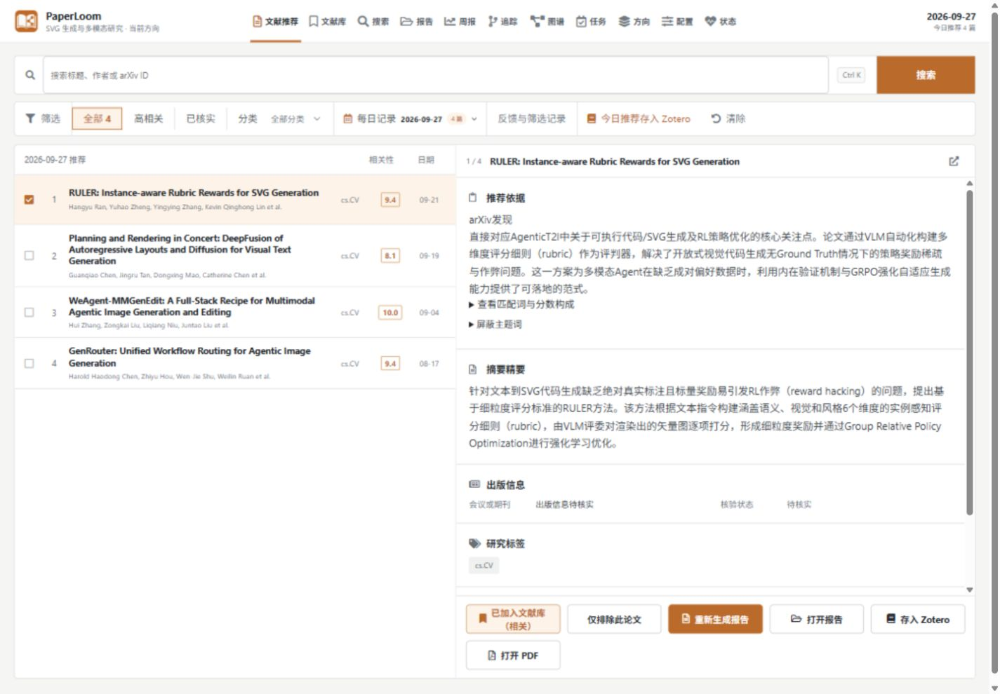
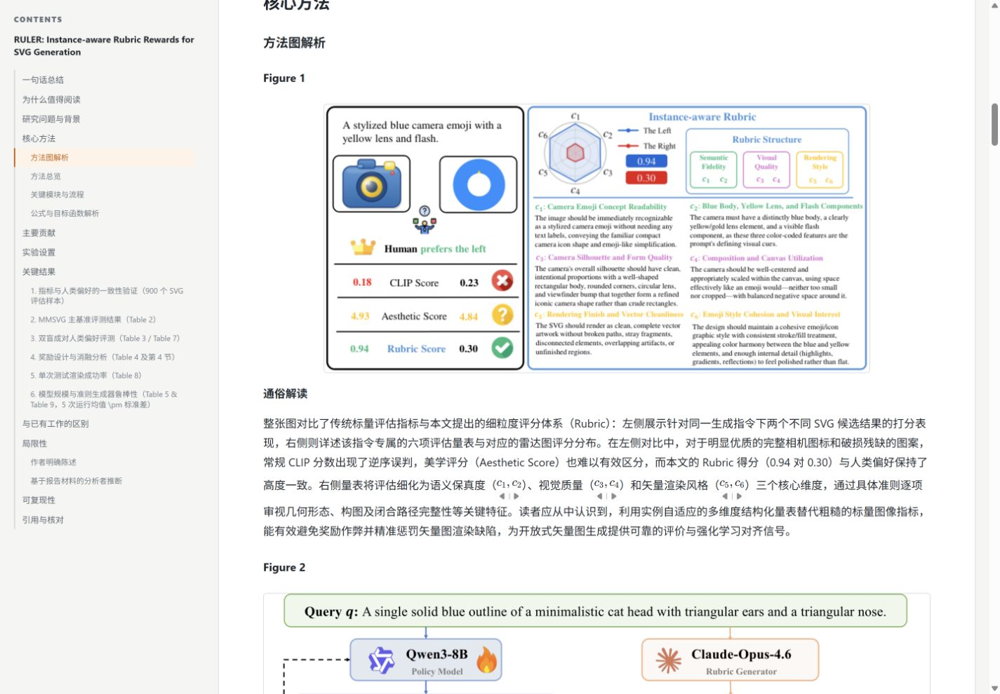
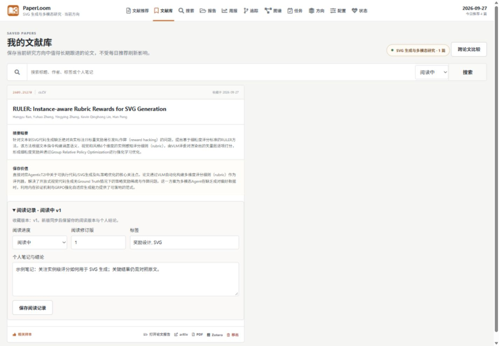
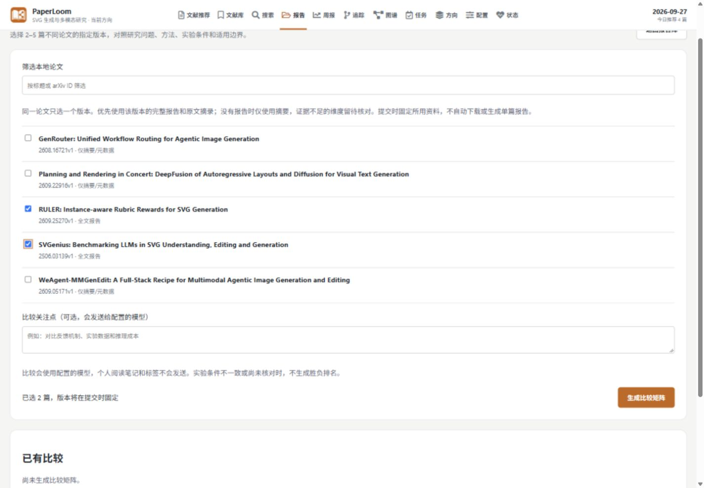

<p align="center">
  
</p>

<h1 align="center">PaperLoom · 知织</h1>

<p align="center">
  <strong>把论文织成知识。</strong><br>
  Weave papers into understanding.<br>
  面向个人研究者的本地优先论文助手。
</p>

<p align="center">
  
  <a href="LICENSE"></a>
  <a href="https://github.com/Dennis-Huangm/PaperLoom/releases/latest"></a>
</p>

<p align="center">
  <a href="#quick-start">快速开始</a> ·
  <a href="#daily-use">网页端使用</a> ·
  <a href="#upgrade">升级</a> ·
  <a href="docs/USAGE.md">完整指南</a> ·
  <a href="#faq">常见问题</a>
</p>

---

PaperLoom 把**发现论文 → 筛选推荐 → 全文阅读 → 研究记录 → 持续跟进**放在同一个工作流中。arXiv 提供类别与关键词检索，alphaXiv 可补充语义候选；你选择深读的论文，系统生成带原文定位的中文报告，并可连接 Zotero、Obsidian 与邮件。

当前版本 **1.4.0**，日常操作以本地网页端为主，CLI 用于脚本与自动化。配置、阅读记录和生成文件由你保存在本地；联网检索和远程模型仍会访问所选服务。参见 [本次发布说明](RELEASE_NOTES_v1.4.0.md) 与 [完整变更记录](CHANGELOG.md)。

## 能做什么

| 能力 | 使用方式 |
| --- | --- |
| 按研究方向发现论文 | arXiv / alphaXiv 候选合并，最近 5 篇收藏引导补充检索，精排随研究方向变化，保留推荐依据与筛选记录 |
| 管理阅读与偏好 | 收藏、排除单篇、屏蔽主题词、撤销反馈；记录待读／阅读中／已读、标签、笔记和已读修订版 |
| 生成中文全文报告 | 方法、公式、结果与可提取的方法图，输出 Markdown / HTML，提供固定论文版本的 PDF 页码及原文定位 |
| 汇总与比较 | 研究活动周报；选择 2–5 篇已知修订版论文，按七个维度生成跨论文比较 |
| 搜索本地材料 | 搜索标题、摘要、报告、已解析 PDF 和个人笔记，按研究方向隔离 |
| 追踪新修订版 | 手动或批量检查、预览变化、同步指定版本，保留历史产物 |
| 管理长期运行 | 持久任务历史、显式中断恢复、兼容检查点复用、多方向定时调度 |
| 备份与导出 | 备份校验、恢复预览与独立目录恢复；按需同步 Zotero / Obsidian 或发送邮件 |

报告生成流程包含数值、表格归属与引用覆盖检查，并共用 Markdown、公式和表格渲染器。依据不足的内容会收敛展示，原始内容保留在核对详情中。**这些检查用于减少常见错误，不能替代对原论文的语义核对。**

<a id="quick-start"></a>
## 快速开始

需要 **Python 3.11+**。Windows 的 Python 3.13 环境有经过验收的依赖约束；其他 Python 版本和平台按依赖声明安装，需自行验证。

从 [Releases](https://github.com/Dennis-Huangm/PaperLoom/releases/latest) 下载 `paperloom-1.4.0-source.zip` 并解压，或克隆仓库：

```bash
git clone https://github.com/Dennis-Huangm/PaperLoom.git
cd PaperLoom
```

### Windows / PowerShell

在包含 `pyproject.toml` 的目录运行：

```powershell
# 建立或更新项目独立环境；无需激活
powershell -ExecutionPolicy Bypass -File scripts\setup_environment.ps1

# 首次运行复制模板，不覆盖已有配置
if (-not (Test-Path config.yaml)) { Copy-Item config.example.yaml config.yaml }
if (-not (Test-Path .env)) { Copy-Item .env.example .env }

# 本地配置和依赖检查，然后启动界面
powershell -ExecutionPolicy Bypass -File scripts\run.ps1 doctor
powershell -ExecutionPolicy Bypass -File scripts\start_gui.ps1
```

浏览器入口为 http://127.0.0.1:8000 。安装脚本、GUI、日常命令与 Windows 计划任务统一使用项目 `.venv`。安装可加 `-WithDocling` 启用可选 PDF 解析器、`-Dev` 安装测试依赖，或用 `-Python "D:\path\to\python.exe"` 指定基础解释器。不要删除创建虚拟环境所依赖的基础 Python。

### Linux / macOS

```bash
python3 -m venv .venv
source .venv/bin/activate
python -m pip install -e '.[gui]'
[ -f config.yaml ] || cp config.example.yaml config.yaml
[ -f .env ] || cp .env.example .env
paperloom --config config.yaml doctor
paperloom --config config.yaml gui
```

默认使用 PyMuPDF，Docling 为可选依赖。Windows 脚本不适用于其他平台；下文通用 CLI 命令均需在已激活环境中运行。

### 首次打开网页：先配置，再创建方向

启动后，后续操作都可以在网页中完成。窄窗口下点击右上角 **☰** 展开导航。

1. 打开 **配置 → API 与凭据**，填写模型 API Key 和 Base URL，点击 **保存 API 与凭据**。已有凭据不回显，留空会保留原值。
2. 在同页 **模型调用** 中填写服务提供的模型名称，再点击底部 **保存全部运行配置**。文本报告需要文本生成能力，方法图解读还需要模型支持图片输入。
3. 首次体验时，在配置页关闭邮件投递、自动周报和自动版本检查；Zotero、Obsidian 等集成按需开启。模板中部分自动功能默认启用，建议先完成一次手动流程。
4. 打开 **方向**，填写方向名称，以及描述、重点关键词或参考论文 arXiv ID，点击 **生成草稿**。检查并编辑草稿，可选试搜，再点击 **保存并启用**；已有方向可直接切换。
5. 到 **任务 → 刷新每日推荐** 点击 **执行检索**。首次可不勾选发送邮件，等待任务完成后打开结果或返回 **文献推荐**。

`doctor` 仅做本地检查，不证明外部服务已连通。不配置模型也能运行基础检索、规则排序和回退报告。字段细节见 [完整使用指南](docs/USAGE.md#configuration)。

<a id="daily-use"></a>
## 网页端使用：从推荐到研究记录

### 1. 挑选值得读的论文

在 **文献推荐** 中点击左侧论文，右侧查看推荐依据、中文摘要与出版信息。通过 **每日记录** 回看历史推荐；搜索框与分类筛选只过滤当前列表。

- 点击 **加入文献库** 保存论文，后续可在文献库持续跟进。
- 点击 **仅排除此论文** 排除单篇；若要屏蔽一类主题，展开 **屏蔽主题词** 明确填写词语。
- 误操作可到 **反馈与筛选记录** 撤销。

默认根据当前方向最近 5 篇收藏补充定向检索，并辅助精排。在推荐详情展开 **本次推荐的收藏引导** 查看依据；可在 **配置 → 研究兴趣与检索范围** 关闭。详见 [近期收藏如何影响推荐](docs/USAGE.md#recent-interest)。



### 2. 生成并阅读全文报告

在推荐详情点击 **生成完整报告**（已有报告时显示 **重新生成报告**），或在文献库点击 **生成论文报告**。也可在 **任务 → 生成完整阅读报告** 直接输入 arXiv ID；例如 `2506.15903v1` 表示指定修订版。

提交后到 **任务** 查看进度，完成后点击结果链接；已有报告也能从 **报告** 或论文卡片打开。阅读页通过目录跳转，显示方法图、公式、结果表和原文定位链接。宽表可以在表格区域内横向滚动。



*报告阅读示例：RULER 公开论文的方法图与生成解读。图示属于原论文；报告用于辅助阅读，关键结论仍需核对原文。*

### 3. 留下自己的阅读结论

进入 **文献库**，展开某篇论文的 **阅读记录**，选择待读／阅读中／已读／暂缓，填写已读修订版、标签和个人笔记，然后点击 **保存阅读记录**。个人笔记与模型报告分别保存。

文献库可按标题、作者、标签、笔记和阅读进度筛选；需要搜索报告或 PDF 正文时，使用顶部 **搜索** 入口。



*截图使用公开论文材料和隔离演示库；收藏、阅读进度与笔记为演示状态。*

### 4. 汇总周报，比较多篇论文

- **研究周报**：进入 **周报**，查看活动统计及历史周报；在 **任务 → 生成研究活动周报** 提交生成。个人笔记默认不附入，勾选后在模型生成完成后本地追加。
- **跨论文比较**：从 **文献库** 或 **报告** 点击 **跨论文比较**，选择 **2–5 篇不同论文的指定版本**，可填写比较关注点，再点击 **生成比较矩阵**。结果在当前页任务区或任务页打开。

比较优先使用所选修订版的完整报告和原文摘录；没有报告时只能使用摘要。提交比较不会自动下载全文或补生成单篇报告。个人笔记和标签不发送给比较模型，不同实验条件也不会直接排出胜负。

<details>
<summary>查看跨论文比较操作截图</summary>

<p align="center"></p>

</details>

### 5. 开启日常调度与备份

| 想做什么 | 网页入口与操作 |
| --- | --- |
| 追踪论文新版本 | **追踪** → 检查版本或同步指定论文；需要时选择生成报告、Zotero 或 Obsidian 同步 |
| 自动刷新多个方向 | **方向 → 多方向调度** → 设置各方向的时间、时区、星期和邮件选项，再启用总开关 |
| 查看失败／中断任务 | **任务** → 查看错误与运行提示；有恢复按钮时显式创建新尝试 |
| 备份本地成果 | **配置 → 备份与恢复** → 创建备份；恢复前先预览范围与冲突，恢复到独立目录 |
| 导出到已有工具 | 在 **配置** 中设置 Zotero / Obsidian，再从论文卡片或相应功能发起操作 |

调度需要 GUI 或独立调度入口保持运行；关闭浏览器标签不等于停止后台服务，关闭启动终端则可能停止服务。自动调度运行推荐日报，**不会为每篇推荐自动生成深度报告**。失败、中断或取消不自动重试；手动恢复推荐任务不发邮件。更完整的运行条件见 [定时运行](docs/USAGE.md#automation) 与 [任务恢复](docs/USAGE.md#任务历史与中断恢复)。

<details>
<summary>命令行与脚本入口（可选）</summary>

日常使用无需反复输入命令；需要脚本自动化时，在已激活环境使用：

```bash
paperloom doctor
paperloom run --no-email
paperloom report 2506.15903v1
paperloom schedule --status
paperloom --help
```

Windows 无需激活，可用 `powershell -ExecutionPolicy Bypass -File scripts/run.ps1 <命令>` 代替 `paperloom <命令>`。旧命令 `arxiv-ra`、模块 `arxiv_ra` 和发行包名 `arxiv-research-assistant` 保持兼容。

</details>

<a id="upgrade"></a>
## 从旧版升级

1. 等待当前任务完成并正常退出 GUI / 调度进程。
2. 备份 `.env`、`config.yaml`、`profiles/` 和配置的输出目录（默认 `run/`）。应用备份默认不包含密钥，凭据请另行妥善保存。
3. 更新源码。Git 安装且工作区干净时可执行 `git pull --ff-only`；源码包安装将新版解压到独立目录后迁移上述数据。已有本地代码改动请先保存。
4. 重新运行 `setup_environment.ps1`（原来使用 Docling 的安装继续加 `-WithDocling`），或在已激活环境执行 `python -m pip install -e '.[gui]'`。
5. 执行 `doctor`，重启 GUI，并刷新浏览器。通过“任务”“调度”“配置”页检查状态，再恢复日常使用。

旧数据按兼容路径读取，历史报告会保留；旧程序不要继续写入同一输出目录。旧的独立 HTML 文件不会自动重写，通过 GUI 打开支持的旧报告时使用共用渲染流程。备份恢复到独立目录后，自动调度始终暂停，需要明确重新启用。

<a id="configuration"></a>
## 配置、数据与隐私

| 位置 | 内容 |
| --- | --- |
| `config.yaml` | 模型、输出目录、PDF、邮件、集成等全局设置 |
| `.env` | API 密钥、服务地址、SMTP 凭据及可选代理配置 |
| `profiles/` | 方向档案及活动方向 |
| `run/`（或自定义输出目录） | 推荐、报告、阅读状态、搜索缓存、任务与调度记录 |
| `.venv/` | 本地 Python 环境及依赖 |

上述个人目录均不进入源码发布包。`.gitignore` 只影响 Git 跟踪，不会在磁盘上隐藏或删除 `.venv`。

活动方向的检索和排序设置会覆盖全局同名段；任务使用提交时的配置。详情见 [配置指南](docs/USAGE.md#configuration)、[配置模板](config.example.yaml) 与 [环境变量模板](.env.example)。

启用远程模型后，论文材料、研究兴趣及方法图可能发送给所选服务。个人阅读笔记不发送给模型；选择追加到周报后，配置的 Obsidian 同步可包含这些内容。Web 界面面向本机使用，支持 `127.0.0.1` / `localhost`，校验 Host 与修改请求来源，不提供多用户登录或自定义域名反向代理部署。

<a id="faq"></a>
## 常见问题

**终端能访问 arXiv，项目却失败？** 请核对实际使用的 Python、代理环境变量、证书和请求地址。统一启动脚本会读取项目 `.env`，已有进程环境变量优先；更改后重启进程。项目包含 SOCKS 代理支持及 arXiv TLS 兼容修复，但外部服务仍可能限流或不可达。不要通过关闭证书校验排错。

**报告为何缺少图片或只有摘要？** 查看运行提示和报告质量标识。图片依赖可用的 PDF / HTML 提取结果；全文下载、解析或模型失败时可能生成回退报告。不是每篇论文都有可靠的可提取方法图。

**看到“—”或待核对提示意味着什么？** 表示当前检查无法支持该数值或发现归属冲突，不代表零，也不代表论文没有报告。详情保留原始内容；没有提示也不代表结论正确。

**重启后任务会重新跑吗？** 不会自动重放。中断任务保留历史与恢复入口；显式恢复会创建新尝试，是否复用步骤取决于检查点兼容性。

**修改了配置却未生效？** 检索与排序可能被方向设置覆盖；排队任务保留提交时快照。更改输出目录或 Python 代码后需要重启 GUI。

## 文档与贡献

[完整使用指南](docs/USAGE.md) 说明配置与高级用法；[架构说明](docs/ARCHITECTURE.md) 和 [发布检查单](docs/RELEASE_CHECKLIST.md) 供维护者参考。阶段计划、临时排查日志和本地评估结果不随主分支维护。

测试代码保留在 Git 仓库，便于验证和贡献；后续面向用户的源码包仅包含运行所需代码、启动脚本和维护文档，不包含 `tests/` 与评估工具。已发布的 v1.4.0 附件保持原样。

<details>
<summary>开发安装与验证</summary>

请克隆仓库后执行：

```bash
python -m pip install -e '.[gui,dev]'
python -m pytest -q
python -m compileall -q src tests
python -m pip check
```

v1.4.0 发布前有 556 项测试通过，并完成桌面与窄屏的代表性页面验收。提交问题时请附操作步骤、版本与脱敏日志，不要上传真实密钥或个人数据目录。

</details>

## 致谢与许可证

感谢 arXiv、alphaXiv、OpenAlex、Semantic Scholar 及项目所依赖的开源工具。Obsidian 知识库的组织思路参考了 [dailypaper-skills](https://github.com/huangkiki/dailypaper-skills)。本项目是独立工具，不代表上述服务的官方产品。

代码采用 [MIT License](LICENSE)。第三方依赖、字体与静态资源保留各自许可证；论文与图片的权利不因项目代码许可证而改变。
