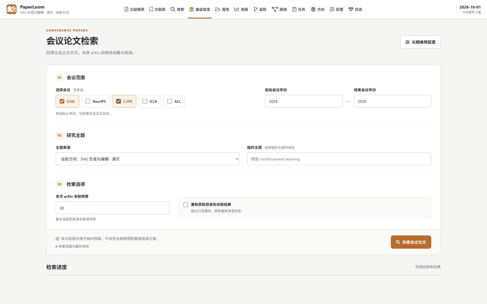

<p align="center">
  
</p>

<h1 align="center">PaperLoom · 知织</h1>

<p align="center">
  <strong>把论文织成知识。</strong><br>
  Weave papers into understanding.<br>
  在本地网页中发现论文、阅读全文、管理研究材料。
</p>

<p align="center">
  <a href="https://github.com/Dennis-Huangm/PaperLoom/releases/latest"></a>
  
  <a href="LICENSE"></a>
</p>

<p align="center">
  <a href="#quick-start">安装与启动</a> ·
  <a href="#web-workflow">网页端使用</a> ·
  <a href="#upgrade">升级</a> ·
  <a href="docs/USAGE.md">网页使用指南</a> ·
  <a href="docs/CLI.md">命令行与自动化</a>
</p>

PaperLoom 是面向个人研究者的论文助手。你定义研究方向，它从 arXiv、alphaXiv 和会议目录发现候选；你挑选值得阅读的论文，生成带原文定位的中文报告，再把材料收录到 Zotero 或 Obsidian。推荐、阅读记录、报告、版本跟进和周报都可以在同一个网页中完成。

**当前正式版本：v1.5.0。** 查看 [发布说明](docs/RELEASE_NOTES.md) 或 [变更记录](CHANGELOG.md)。应用运行在你的电脑上，配置和成果保存在本地；联网检索与模型生成会访问你配置的服务。


## 从发现到阅读

| 你想做什么 | PaperLoom 提供什么 |
| --- | --- |
| 建立一个可持续跟进的研究主题 | 研究方向草稿、参考论文检查、试搜和可编辑筛选条件 |
| 每天发现相关新论文 | arXiv 与 alphaXiv 检索、推荐依据、近期收藏引导、历史推荐记录 |
| 补读会议上的相关工作 | ICML、NeurIPS、CVPR、ICLR、ACL 的多年份检索与 arXiv 关联 |
| 阅读一篇论文的方法与实验 | 中文全文报告、公式、结果表、可提取的方法图及 PDF 原文定位 |
| 留下自己的理解 | 文献库、阅读进度、已读修订版、标签和个人笔记 |
| 探索或比较相关工作 | 区分引用与内容相似的相关工作地图；2–5 篇指定版本论文的比较 |
| 让材料进入已有研究工具 | Zotero 文献与附件、Obsidian 托管笔记、逐目标收录回执 |
| 长期跟进与回顾 | 版本追踪、多方向定时推荐、研究周报、本地全文搜索、备份与恢复 |

<a id="quick-start"></a>
## 安装与启动

需要 **Python 3.11+** 和可用的网络。Windows Python 3.13 提供依赖约束；Linux、macOS 及其他 Python 版本可按标准 Python 环境安装。发行附件为源码包和 Python wheel，**不是独立免安装程序**。

从 [最新 Release](https://github.com/Dennis-Huangm/PaperLoom/releases/latest) 下载 **`paperloom-1.5.0-source.zip`**，解压到一个固定目录。首次安装会从包仓库下载依赖。

### Windows

1. 安装 Python，确保安装时将 Python 加入 PATH。
2. 双击 **`Setup-PaperLoom.cmd`**。它建立项目独立环境、安装依赖，并在配置不存在时创建配置模板。看到安装完成后关闭窗口。
3. 双击 **`Start-PaperLoom.cmd`**。浏览器会打开 [本地网页](http://127.0.0.1:8000)。

以后使用只需双击 `Start-PaperLoom.cmd`。**服务窗口需要保持运行**；关闭浏览器标签不会停止服务，在服务窗口按 `Ctrl+C` 可退出。不要移动或删除创建 `.venv` 所依赖的基础 Python。

如需指定 Python 路径、安装可选 Docling 解析器或更改端口，见 [安装与启动参数](docs/CLI.md#installation)。

### Linux / macOS

在解压目录打开终端，完成一次安装并启动：

```bash
python3 -m venv .venv
source .venv/bin/activate
python -m pip install -e '.[gui]'
[ -f config.yaml ] || cp config.example.yaml config.yaml
[ -f .env ] || cp .env.example .env
paperloom gui
```

以后进入同一目录，激活环境并运行 `paperloom gui` 即可。启动后的日常操作在网页中完成。

<a id="web-workflow"></a>
## 网页端使用

### 1. 配置模型，建立研究方向

打开 **配置 → API 与凭据**，填写模型 API Key 和服务 Base URL 并保存；再在 **模型调用** 中填写该服务可用的模型名称，保存运行配置。方法图解读需要模型支持图片输入。已有凭据不会回显，留空会保留原值。

打开 **方向**，填写主题、重点关键词或参考论文 arXiv ID，点击 **生成草稿**。检查系统理解的主题、必要条件与排除条件，修改后保存；可先试搜、检查参考论文，再 **启用此方向**。已有方向可直接切换。

新安装默认关闭邮件投递、Zotero、自动周报和自动版本检查，先完成一次手动流程，再按需开启。没有模型也能进行基础检索与规则排序，全文解读和语义筛选的能力会受限。

### 2. 获取推荐，挑选值得读的论文

到 **任务 → 刷新每日推荐** 执行检索，等待完成后打开 **文献推荐**。点击左侧论文，在右侧查看推荐依据、摘要和出版信息。

- 用“全部 / 高相关 / 已核实”、分类或搜索筛选当前列表，通过 **每日记录** 回看历史。
- 点击 **加入文献库** 保存论文；用 **仅排除此论文** 或 **屏蔽主题词** 表达负反馈，误操作可在 **反馈与筛选记录** 撤销。
- 系统可用当前方向最近 5 篇收藏补充检索；推荐详情的 **本次推荐的收藏引导** 显示依据。

需要补读会议论文时，打开 **会议论文**，多选会议并设置起止会议年份，选择当前方向、临时主题或浏览目录，再点击 **检索会议论文**。结果提供来源状态和会议归属，收藏后接入文献库流程。长期推荐也可选择“最新 arXiv / 会议论文 / 混合推荐”模式。



### 3. 生成报告，记录阅读结论

在 **任务 → 生成完整阅读报告** 输入 arXiv ID，或从文献库提交报告生成。带 `v` 后缀的 ID（如 `2506.15903v1`）表示指定修订版。到 **任务** 查看进度，完成后从结果链接或 **报告** 页面打开。

报告包含中文解读、公式、结果表、可提取的方法图和原文定位。模型、全文下载或解析失败时，结果会标为摘要级回退，后续可从任务页 **继续全文分析**。重要结论和数值请结合原论文核对。


在 **文献库 → 阅读记录** 保存阅读进度、已读修订版、标签和个人笔记。需要检索本地报告、PDF 或笔记时，打开顶部 **搜索**。个人笔记与模型报告分别保存。

### 4. 收录到 Zotero 或 Obsidian

在 **配置** 中启用并设置对应工具，然后从推荐、文献库或报告进入 **收录与同步**。确认论文修订版、报告和目标位置后提交，查看每个目标的回执；已有可靠关联时可直接打开条目或笔记。

Zotero 使用桌面端本地 API 保存文献及附件；Obsidian 写入你指定的知识库，更新托管区块并保留区块外的个人内容。收录不改变收藏或阅读状态，也不会自动生成报告。具体配置见 [收录与集成](docs/USAGE.md#integrations)。

### 5. 跟进版本，整理相关工作

| 网页入口 | 操作 |
| --- | --- |
| **图谱** | 选择起点论文生成相关工作地图，查看引用、内容相似、关联依据和来源状态 |
| **文献库 / 报告 → 跨论文比较** | 选择 2–5 篇不同论文的指定版本，填写关注点并生成比较矩阵 |
| **追踪** | 检查新版本，预览单篇或批量同步，保留旧版资料 |
| **周报** | 生成研究活动回顾；个人笔记仅在勾选后本地追加 |
| **方向 → 多方向调度** | 设置时间、时区、星期及邮件选项，然后启用总开关 |
| **配置 → 备份与恢复** | 创建备份，预览恢复范围与冲突，恢复到独立目录 |

定时推荐需要应用或独立调度进程保持运行；它不会为每篇推荐自动生成全文报告。失败或中断任务保留历史，由你明确选择恢复。完整操作与运行边界见 [网页使用指南](docs/USAGE.md)。

<a id="upgrade"></a>
## 从旧版升级

1. 等待任务结束，停止旧版服务及调度进程。
2. 备份 **`.env`、`config.yaml`、`profiles/` 和输出目录**（默认 `run/`）。应用备份默认不包含密钥，凭据需另行保存。
3. 将新版源码包解压到独立目录，把上述数据复制进去，再运行安装与启动入口。Git 安装且工作区干净时也可使用 `git pull --ff-only` 后重新安装依赖。
4. 刷新网页，检查方向、文献库和历史报告，再恢复调度。通过备份恢复的副本默认暂停自动调度。

安装脚本不会覆盖已有配置。历史报告及兼容入口继续保留；不要让新旧程序同时写入同一输出目录。移动目录后，Zotero 链接附件或 Obsidian 外部关联可能需要检查。

## 数据、服务与常见问题

| 本地位置 | 保存内容 |
| --- | --- |
| `config.yaml` / `.env` | 全局配置、API 密钥及服务凭据 |
| `profiles/` | 研究方向、草稿和活动方向 |
| `run/` 或自定义输出目录 | 推荐、报告、阅读状态、缓存、任务和调度记录 |
| `.venv/` | 项目独立 Python 环境 |

个人配置、密钥、研究数据和本地环境不进入 Git 仓库或发布包。启用远程模型后，相关论文材料、研究兴趣与图像可能发送给所选服务；个人笔记不发送给模型，选择附入周报后可随本地同步写入 Obsidian。

网页面向本机单用户使用，默认地址为 `127.0.0.1:8000`，也支持 `localhost`。它不提供多人登录或公网部署能力。

**网页打不开？** 先看服务窗口是否报错，确认安装完成且端口可用。端口被占用时可按 [启动参数](docs/CLI.md#installation) 改端口。

**检索失败或报告只有摘要？** 在 **任务 / 状态** 查看提示，检查模型、网络和 PDF 获取状态。浏览器能访问 arXiv 不代表 Python 请求使用同一代理路径，修改环境变量后需重启服务。

**会议检索没有结果？** 查看来源状态，区分未公布、来源失败、未关联和预算截断。结果仅包含成功关联 arXiv 的主会正式长文；会议年份与 arXiv 上传年份不同，目录覆盖不保证完整。ICLR 在部分情况下需要于配置页填写 OpenReview 账号。

**配置修改没有生效？** 当前方向的检索与排序设置可能覆盖全局同名项；已排队任务保留提交时配置。修改输出目录后需重启服务。

更多说明：[网页使用指南](docs/USAGE.md) · [命令行与自动化](docs/CLI.md) · [问题反馈](https://github.com/Dennis-Huangm/PaperLoom/issues) · [贡献与验证](CONTRIBUTING.md)。反馈请附版本、复现步骤和脱敏错误信息。

## 致谢与许可证

感谢 arXiv、alphaXiv、OpenAlex、Semantic Scholar、OpenReview 及项目依赖的开源工具。Obsidian 知识库组织思路参考了 [dailypaper-skills](https://github.com/huangkiki/dailypaper-skills)。本项目是独立工具。

代码采用 [MIT License](LICENSE)。第三方依赖、字体、论文文字与图示保留各自许可证和权利，软件截图仅用于展示操作方式。
