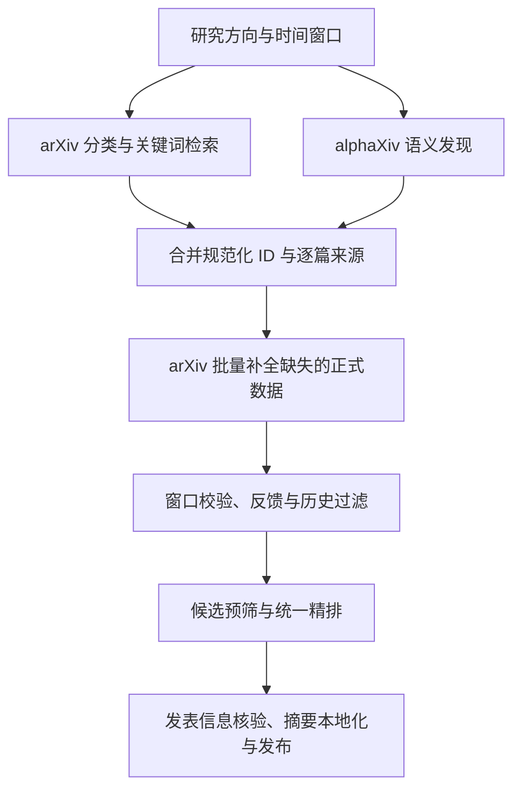

# arXiv / alphaXiv 协作审核

> 后续修复已实施：F1–F7 及 hybrid 协作模式，见 [修复与验证记录](HYBRID_DISCOVERY_IMPLEMENTATION.md)。以下保留修复前的审核证据与原始建议。

审核日期：2026-09-16。范围：当前工作目录源码、配置加载、发现/排序/报告链路、共享限流、Web 作业和相关测试。目录没有 `.git`，因此这是当前源码快照审核，不是某个提交的差异审核。此次新增审核文档与离线复现脚本，没有修改生产逻辑、用户配置或历史研究数据。

## 结论

现有实现严格采用“arXiv 抛出异常后才调用 alphaXiv”的模式。`auto` 不代表双源协作；即使 alphaXiv 已启用，arXiv 正常返回空列表时也不会调用它。建议增加明确的 `hybrid` 模式：arXiv 执行分类/关键词检索，alphaXiv 主动提供语义候选，合并 ID 后由 arXiv 补齐正式论文数据，再进行统一排序与展示。

已有可复用基础包括 `ArxivClient.get_many()`、进程内共享节流、按研究方向保存推荐 JSON、独立排序器和元数据核验模块。需要先修复下面的数据完整性与筛选问题，否则直接拼接两个 `list[Paper]` 会放大现有问题。

## 验证与限制

- 完整现有测试：`104 passed, 1 warning`，8.51 秒。唯一警告是本机 Starlette TestClient 对 httpx 的弃用提示。
- 首次指定 pytest 临时目录时其父目录 `work/` 不存在，导致 fixture 初始化错误；创建父目录并重新运行后全通过。这不是业务测试失败。
- 新增 `work/review_discovery_repro.py`，全部为离线 mock 或临时目录操作，断言用于确认当前问题，不是修复后的验收测试。输出见 `work/review-discovery-evidence.json`。
- 本次 Python 为 `D:\miniconda3\python.exe`，HTTPX 0.28.1；当前进程检测到 HTTP/HTTPS/ALL 代理均指向 `http://127.0.0.1:10808`。一次公开 arXiv ID 查询返回 HTTP 200、`application/atom+xml` 和 Atom feed。
- 未调用 alphaXiv 的真实 AI 检索，也未验证它的实时额度、延迟或当前服务端对不完整 MCP 握手的容忍程度。未发送邮件或写入 Zotero/Obsidian。
- 这次成功访问不能证明最终出口就是截图中的节点，也不能证明独立启动的 GUI、计划任务与当前进程使用相同环境。

复现命令（项目根目录 PowerShell）：

```powershell
$env:PYTHONPATH = (Resolve-Path src).Path
python work/review_discovery_repro.py
```

## Review findings

### F1 · P1：历史去重过晚，使有新论文的检索结果变成空推荐

位置：`src/arxiv_ra/pipeline.py:106`，`188–201`。

`_rank_candidates()` 先截取 `prefilter_count`，`_select_candidates()` 才排除 `processed`。当前 N 篇都已经推荐过，第 N+1 篇即使未见过、满足全部条件，也没有机会进入选择。arXiv 正常时没有 alphaXiv 的空结果保护，后续还可能把当天已有日报覆盖为空。

复现：召回 3 篇、预筛 2 篇，历史包含前 2 篇；仍有 1 篇新论文，实际选中 0 篇。当前真实配置预筛 50 篇、推荐 20 篇、多次刷新且 45 天回溯，使这个问题尤其相关。

建议：把 `force` 和历史集合传给候选选择阶段，在预筛/LLM 精排名额截断前排除历史、显式不相关和硬性无效数据；最终持久化仍在成功发布后提交。

### F2 · P1：共享来源文件会改变其他运行的筛选结果

位置：`src/arxiv_ra/pipeline.py:81–98`，`119–127`，`167–170`。

所有研究方向在同一日期目录读写/删除 `discovery-source.txt`。它不只是日志：存在与否决定是否降低概念组阈值、是否给全部论文添加 alphaXiv 来源说明，以及空推荐是否抛异常。另一运行在 `_rank_candidates()` 开头删除文件，就能改变尚未完成的运行的行为；反向交错也可能把 arXiv 论文误标为 alphaXiv。

离线确定性交错复现：A 的最低概念组数为 2、论文命中 1 组，A 降级独立执行保留 1 篇；A 写来源标志后让 B 执行，再回到 A，A 保留 0 篇。无需概率性线程竞争即可复现同一执行次序。GUI 有并发队列，独立 CLI/GUI 进程也可并行；队列合并相同任务不能替代数据隔离。

建议：使用内存中的运行结果和逐篇 `discovery_sources` 控制逻辑。诊断文件使用 profile/run 唯一路径，作为输出而非状态开关。`candidates.json` 同样需要按方向隔离。双源合并后尤其不能通过一个全局布尔值降低整批论文门槛。

### F3 · P2：缺失日期被伪造为今天，版本和摘要完整性丢失

位置：`src/arxiv_ra/alphaxiv.py:244–268`、`314–320`；关联 `ranker.py:38–39`。

解析失败或缺少发布日期时，`_date()` 返回当前时间。`published_after` 只传给上游，没有在返回后验证。本地排序会因此把未知日期当作最新论文。适配器还把 `abstract_preview` 存入正式 `abstract`，把 `updated` 设为首发日期，丢弃 ID 的版本后让 `Paper.version` 默认为 1。

复现：输入 `1706.03762v7` 且日期缺失，得到审核当天的发表日期和 `version=1`；请求 2026-09-14 之后的论文，mock 返回 2017-06-12 的记录仍被接受。这证明本地校验缺失，不表示线上 alphaXiv 必然忽略日期参数。

建议：先构造允许未知字段的 `DiscoveryCandidate`，保存摘要预览、来源和可选日期/版本；由 arXiv 批量补全后再生成完整 `Paper`。无法补全时显式标记 `metadata_status=partial`，不合成日期，不声称掌握版本；日期不明的条目不进入严格时间窗口的正常推荐。

### F4 · P2：降级快照在 API 恢复后不会补全，来源还可能被误写为 arXiv

位置：`src/arxiv_ra/pipeline.py:333–336`、`356–365`；`src/arxiv_ra/metadata.py:49–80`。

报告生成优先返回本地 `Paper` 快照，只有完全没有快照才请求 arXiv；`force=True` 也不会改变这一点。此前由 alphaXiv 摘要预览创建的缺作者、缺类别、默认版本快照因此会持续用于后续报告。现有 MetadataVerifier 只补独立 `VerifiedMetadata`，不会恢复 Paper 的完整摘要、类别、更新时间或版本。OpenAlex/Semantic Scholar 都没结果时还会填 `sources=["arXiv only"]`，与实际来源不符。

复现：保存一个 alphaXiv 风格的简略推荐快照，调用 `report_arxiv_id(..., force=True)`，arXiv 调用次数仍是 0；两个核验接口返回空时，来源为 `arXiv only`。

建议：给缓存记录增加完整性、正式数据来源和获取时间。对完整缓存保留复用；对 partial 快照在 API 可用时补全并更新缓存。来源应跟随实际获取过程，不能由默认字符串推断。

### F5 · P2：强制刷新在 alphaXiv 路径仍被历史排除

位置：`src/arxiv_ra/pipeline.py:153`；`src/arxiv_ra/alphaxiv.py:73–92`。

`run(force=True)` 只在最后选择时放开历史去重，发现阶段仍将全部 `_processed_ids()` 发给 alphaXiv，且在客户端再次过滤。历史论文在进入选择之前已被删除，因此强制刷新不能恢复这些论文；只有已推荐的结果时还会抛“未返回可用论文”。

复现：历史包含唯一候选，运行 force=True；alphaXiv 收到的 `excluded_ids` 仍包含该 ID。

建议：统一历史过滤语义；force=True 不传历史排除，保留显式负面反馈等独立约束。避免发现和选择阶段分别实现冲突的去重规则。

### F6 · P2：arXiv 的 Retry-After 被截断，可能过早重试

位置：`src/arxiv_ra/arxiv_client.py:102–111`。

虽然读取了 Retry-After，但共享冷却用了 `min(delay, 60.0)`，日期格式的 Retry-After 也无法解析。服务端要求等待更久时，客户端提前恢复请求，可能继续获得 429。

假时钟复现：第一次返回 HTTP 429 / Retry-After:120，第二次请求在 60 秒后发生，而不是 120 秒。当前的进程内节流机制值得保留；问题在等待时间解析/截断，不在于应当移除限流。

建议：支持秒数和 HTTP-date，至少遵守有效服务端等待时间。如果超过作业等待预算，返回带下次可请求时间的暂不可用状态，由协作层继续利用其他已完成来源，不提前重试。GUI 与计划任务并行时，还应考虑跨进程共享节流或统一请求进程。

### F7 · P2：MCP 初始化缺少 initialized 通知

位置：`src/arxiv_ra/alphaxiv.py:158–184`。

实际发送顺序只有 `initialize → tools/call`，缺失 `notifications/initialized`，也没有检查返回协议版本。严格实现握手生命周期的服务端可能不接受正常工具请求。现有测试断言恰好两次请求，因此不会发现这一兼容性问题。

建议：按协议完成生命周期，通知响应允许 HTTP 202 空正文，检查协商版本。SSE 解析应按事件组装并匹配 JSON-RPC 请求 ID，不能默认最后一个 `data:` 就是调用结果。后者为适配器加固建议，本次没有验证线上会发送哪类尾随事件。

这是协议兼容性缺陷，不是“已证实当前 alphaXiv 线上拒绝”的结论。[MCP 2025-03-26 lifecycle](https://modelcontextprotocol.io/specification/2025-03-26/basic/lifecycle) 要求初始化成功后发送通知。

## 当前目标与实际配置差距

活动方向为 `agentict2i`，有效 discovery 配置来自 `profiles/agentict2i.yaml`，会替换全局配置的 discovery 段。仅修改 `config.yaml` 的来源模式可能不影响当前方向。

| 项目 | 当前有效值/行为 | 协作时的处理 |
| --- | --- | --- |
| 来源 | auto + fallback enabled | 新增明确 hybrid 模式 |
| 回溯 | 45 天 | 两路使用同一窗口，补全后统一验证 |
| arXiv 候选预算 | 500 | 保留独立预算 |
| alphaXiv 单次保留数 | 最多 15 | 设置独立预算，不复用 500 的参数造成误解 |
| 预筛/推荐数 | 50 / 20 | 去重后预筛，允许两路候选参加 |
| 最少概念组 | 2，降级时整体减 1 | 消除运行级隐式放宽，明确硬约束与软相关性特征 |
| arXiv 成功/空结果 | 都不调用 alphaXiv | hybrid 下均主动调用 |
| 报告/参考论文解析 | 各自复制 auto 分支判断 | 复用统一解析器，模式扩展覆盖全部入口 |

alphaXiv 官方文档将 `discover_papers` 定义为结合关键词与语义检索的候选发现工具，返回约 5–15 篇及摘要预览；它有自己的 AI 调用额度和检索耗时。因此更适合主动补充语义召回，而不是模拟 500 条完整 Atom 元数据。[alphaXiv MCP 文档](https://www.alphaxiv.org/docs/mcp)

## 建议的协作架构



两路可以并发发起；所有 arXiv 调用仍通过同一个节流器。双源协作的核心是两路都参与每次发现，与是否并发是两个独立选择。arXiv 已经返回的完整数据直接复用；alphaXiv 新增 ID 用 `get_many()` 分批补全，当前方法每次最多处理 50 个 ID，超过时需要显式分批。

逐篇记录至少包含：

- `discovery_sources`: arxiv / alphaxiv，可同时出现。
- `metadata_source`: 正式论文数据实际来自哪里。
- `metadata_status`: complete / partial。
- `abstract_kind`: full / preview。
- 原始候选排名、召回时间、补全时间、必要的失败原因。

重复 ID 合并来源，保留 arXiv 完整数据，禁止 alphaXiv 的空作者/摘要预览覆盖已有完整记录。保留版本字段，按无版本 ID 去重。对历史 partial 快照做惰性修复，不把“有缓存”视为“缓存完整”。

排序需要兼顾语义发现的作用：如果仍把全部概念组精确词匹配设为硬门槛，alphaXiv 找到的同义表达可能继续被丢弃。建议负面反馈、日期和身份校验作为硬约束，概念覆盖与两路检索排名用于相关性评分；确有必要的硬性概念约束应显式配置。不要把两路原始分数直接相加，也不要为了凑数无条件塞入 alphaXiv 候选。用固定样本评估 alphaXiv 独有候选进入最终推荐的数量和质量。

运行级 manifest 按 profile 和 run 保存，例如 `run/YYYY-MM-DD/discovery-<profile-id>-<run-id>.json`，记录各源状态、耗时、原始数量、独有数量、去重数量、补全失败数量及最终推荐数量。UI 展示“arXiv 检索 / alphaXiv 发现 / 两源发现”和“完整 / 待补全”，替换“API 不可用时召回”的固定文案。

| arXiv | alphaXiv | 建议运行结果 |
| --- | --- | --- |
| 成功 | 成功 | 合并、补全、统一筛选 |
| 成功 | 超时/失败/未配置 | 发布 arXiv 结果，记录增强源状态 |
| 失败 | 成功 | 利用已有完整缓存，其他条目标记待补全；不逐篇重复撞击冷却中的 API |
| 失败 | 失败 | 明确失败，保留上次已发布结果 |
| 成功且为空 | 成功且为空 | 合法无新结果，与网络失败、全部已读和解析失败分别表示 |

## 配置与实施顺序

以下是建议的新字段，当前程序尚不支持，不能直接复制进现有 YAML：

```yaml
discovery:
  provider: hybrid
  alphaxiv_enabled: true
  alphaxiv_max_candidates: 15
  alphaxiv_difficulty: 5
```

保留 `arxiv` 单源；旧 `auto` 暂保留“失败后替代”的语义以兼容已有配置，将 hybrid 作为当前需求的显式选择。后续若迁移 auto，应在 UI 中说明每次调用 alphaXiv 的行为和额度影响。不要新增含义重叠的多个开关而没有清晰的优先级。

建议分三步实施：

1. 修复筛选顺序、force 传递、来源文件耦合、日期/版本/完整性模型、Retry-After 与 MCP 生命周期；补回归测试。
2. 提取 `DiscoveryService` 和论文补全/缓存解析器，增加 hybrid 召回、ID 合并、批量补全、独立超时/错误状态。日报、单篇报告、研究方向参考论文共同使用。
3. 更新 profile 配置迁移、Web 表单校验、服务状态、报告来源展示和文档；使用固定研究方向样本比较召回增益、重复率、时延和调用额度。

涉及模块：`config.py`、`alphaxiv.py`、`arxiv_client.py`、新增发现协调层、`models.py`、`pipeline.py`、`profiles.py`、`storage.py`、`ranker.py`、`metadata.py`、`web.py`、`web_settings.py`、`templates/settings.html` 以及相关测试。

最低验收场景：两源成功且部分重复；arXiv 返回空而 alphaXiv 有结果；单源超时；两源失败保留旧日报；缺日期/错日期/缺摘要/版本冲突；历史占满预筛；force 刷新；多 profile 交错执行；旧 partial 快照在网络恢复后补全；MCP 正常通知/202/SSE；长 Retry-After；没有 alphaXiv key；旧配置兼容。

## 截图中的路由规则

按 Xray 路由语义，`domain:arxiv.org` 匹配主域和子域，因此覆盖代码实际访问的 `export.arxiv.org`。规则按顺序匹配，首个有效规则决定出口。截图不能验证完整规则顺序或实际出口；它也不包含独立域名 `api.alphaxiv.org`，该域名会按其他适用规则路由。[Xray 路由文档](https://xtls.github.io/en/config/routing)

项目创建 HTTPX Client 时使用默认环境代理行为。本机 HTTPX 实现调用 `urllib.request.getproxies()`，Windows 上还可回退读取系统代理；因此不能简单断言“Python 一定不使用 v2rayN 系统代理”。本次已在当前进程观察到本地代理并完成一次成功查询。[HTTPX 环境变量文档](https://www.python-httpx.org/environment_variables/)

固定可用出口改善连接条件，不意味着可以删除节流或保证永久没有 429。arXiv 现行文档要求 legacy API 请求至少间隔三秒、一次单连接。项目当前同进程串行节流可以保留，继续修正等待时间处理和多进程场景即可。[arXiv API 使用说明](https://info.arxiv.org/help/api/tou.html)
