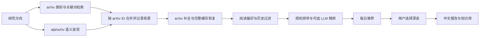

# PaperLoom 使用指南

安装与升级请先阅读 [README](../README.md)。本文保留各功能的配置、命令和运行边界。

<a id="discovery"></a>
## arXiv 与 alphaXiv 如何协作



上图对应 `hybrid` 模式。三种模式的区别是：

| `discovery.provider` | 行为 |
| --- | --- |
| `hybrid` | 每次尝试两路发现，合并去重后补全；alphaXiv 主动扩展候选集 |
| `arxiv` | 仅使用 arXiv，适合没有 alphaXiv 凭据的环境 |
| `auto` | 兼容旧行为：仅在 arXiv 检索失败后调用 alphaXiv |

启用协作检索时，在 `.env` 中填写 `ALPHAXIV_API_KEY`，并在**当前研究方向**的 `discovery` 段设置：

```yaml
discovery:
  provider: hybrid
  alphaxiv_fallback_enabled: true
  alphaxiv_max_candidates: 15
  alphaxiv_minimum_concept_groups: 1
```

`alphaxiv_fallback_enabled` 沿用了旧配置名称，现在同时控制 `hybrid` 与 `auto` 中的 alphaXiv 开关。本项目的 alphaXiv 候选上限为 15，与 arXiv 候选上限独立。API 的可用性、额度和费用以服务提供方为准。

**失败时保留可用信息。** 单路失败时仍处理另一来源的结果；arXiv 补全失败时优先复用完整本地缓存。摘要预览与未核实信息不会伪装成完整元数据，也不会把未知发布日期填成今天。两路都失败时保留已发布推荐；同日没有符合条件的新论文时，也保留已有推荐。

每次发现的来源状态、耗时与补全计数写入 `discovery-<profile>-<run-id>.json`，便于区分网络失败、空结果和筛选后无候选。

同日多次刷新会累计保留当天推荐，并按论文 ID 和修订版去重。每批原始推荐及发布前的历史副本保存在当日 `batches/<profile>/<batch-id>/` 中；邮件仍只投递本次入选论文。周报收集推荐时对同日同论文使用最高版本；有研究活动时优先纳入活动涉及的版本，阅读旧版不会借用新版摘要。原始推荐记录保持不变。

<a id="configuration"></a>
## 配置与研究方向

### 配置放在哪里

| 文件 | 职责 |
| --- | --- |
| `config.yaml` | 模型、输出目录、PDF、邮件、集成、任务并行数等全局设置 |
| `.env` | API 密钥、服务地址和 SMTP 凭据；从配置文件所在目录加载 |
| `profiles/<id>.yaml` | 某个研究方向的检索与排序配置 |
| `profiles/active.txt` | 当前启用的研究方向 |

首次运行时会为尚无方向档案的项目建立默认方向。**活动方向的 `discovery` 和 `ranking` 段会覆盖全局同名段**；已有方向后，只修改 `config.yaml` 的检索字段可能不会生效。推荐通过 GUI 修改，或编辑当前方向的 YAML。完整字段见 [配置模板](../config.example.yaml) 和 [环境变量模板](../.env.example)。

```bash
paperloom --config config.yaml profiles
paperloom --config config.yaml activate your-profile-id
```

关键词宜描述具体任务、方法和模态。负向关键词用于降低得分；“仅排除此论文”只按论文 ID 排除，不自动学习相似主题。需要过滤同类论文时，可展开“屏蔽主题词”并明确填写词或短语。收藏与排除互斥，正向偏好学习仅取当前方向最近收藏的 30 篇论文。旧版本留下的相似主题规则保持原行为，在“反馈与筛选记录”中单独标示并可撤销。

后台任务使用**提交时的配置和研究方向**。切换方向或修改设置影响后续提交，不改变已排队任务。GUI 并行数通过 `jobs.max_parallel` 调整，范围为 1–8，默认 3。

### 任务历史与中断恢复

GUI 任务的提交内容、进度、警告、状态和结果链接会写入本地任务台账，重启后仍可从“任务 → 后台任务”查看。历史每页 25 条，首页额外保留未完成和待恢复任务。关闭或异常退出时，未完成任务会显示“已中断”，**不会自动重新执行**。

切换到任务原来的研究方向，点击“重新执行”（报告为“继续全文分析”）可创建关联的恢复任务，原记录继续保留；重复点击不会再创建同一次恢复任务。恢复使用保存的配置，可能再次调用模型和已配置的同步，具体行为如下：

| 任务 | 恢复行为 |
| --- | --- |
| 完整阅读报告 | 使用所选快照或首次执行已解析的论文版本；若无版本 ID 尚未解析，则重新查询。校验后复用已保存解析、分片与整合结果，保留旧产物 |
| 每日推荐 | 保留原检索配置和强制刷新选项，重新检索并应用当前阅读偏好；恢复时不发送邮件，避免重复投递 |
| 研究活动周报 | 保留原统计截止时间和个人笔记选项，重新读取符合截止时间的本地活动与资料；实际生成时间另行记录 |
| 跨论文比较 | 使用原论文版本和提交时的证据快照重新生成 |
| 版本同步批次 | 继续原批次，跳过已完成论文并复用已有步骤记录 |

报告任务页显示解析、已完成分片数和整合状态。模型失败后生成的摘要级回退报告仍可打开，同时提供“继续全文分析”。已完成的模型响应先保存再进入下一步；若全部分片已保存而整合失败，恢复只需继续整合。新提交的报告独立生成，仅原任务的恢复链共享中间结果。

复用前校验论文快照与方向、PDF 内容、解析结果/设置，以及模型名称、实际服务地址、温度、分片大小和具体文本提示词。图片解释还校验图片内容、标题、摘要和图注。输入变化、缺失或损坏时提示并重新执行相关步骤。恢复仍使用原提交配置；需要采用修改后的模型配置时，请新建报告任务。

中间结果保存在私有 `.jobs/report-work/`，包含全文、图片与模型输出，不能从产物接口下载。它们是可重建缓存，**不包含在当前备份包内**；备份恢复后的任务保留历史，但缺少中间文件时需重新处理。原报告与结果链接不会被恢复任务覆盖。元数据核验和 HTML 方法图获取仍会执行；已配置的外部同步可能重复。不保证正在请求但尚未落盘的响应可以复用，也不承诺外部写入精确一次。

其他 GUI 任务也保留历史，但需从各自功能入口重新提交或继续。分步骤恢复首版仅接入 GUI 单篇报告，未扩展到独立 CLI 报告、每日任务内的报告或批次内部报告；版本同步批次继续使用原有步骤记录。程序升级前未保存的中间结果无法补回。

同一输出目录同时只允许一个 GUI 队列运行；关闭 GUI 后仍在执行的工作结束前，目录继续由原队列占用。台账位于输出目录的 `.jobs/`，不通过产物下载接口提供；密钥等环境变量配置保留变量名称，不复制运行时变量值。CLI 独立命令尚未接入通用台账，版本同步批次原有恢复机制继续可用。

### 备份与恢复

打开 **配置 → 备份与恢复**。备份覆盖全部研究方向，默认包含配置、方向档案、收藏、阅读进度、笔记、反馈、推荐 JSON、版本状态/批次和 GUI 任务台账。可以分别勾选报告及配图、本地 PDF、`.env` 凭据。PDF 单独勾选时保留相应元数据。搜索索引、锁文件、程序代码、外部 Zotero 库和 Obsidian vault 不纳入备份。

备份 ZIP 保存在项目的 `backups/`，包含版本化清单、文件大小和 SHA-256，生成后校验成功才发布。`.env` 默认不包含，也不会读取进程中的环境变量值；勾选后凭据会**明文**写入 ZIP。即使不包含 `.env`，配置和笔记仍可能含有私人信息，因此备份不是脱敏分享包。

恢复采用“校验 → 预览 → 执行”流程：粘贴本机 ZIP 完整路径，填写恢复目录名称，选择保留现有文件或替换冲突文件。页面列出新增、相同、保留、替换的数量及全部文件。备份或目标在预览后变化时拒绝执行，要求重新预览。

第一版恢复到当前项目的 **`restored/<名称>/` 独立目录**，不覆盖当前运行环境。输出配置迁移为 `run`，任务/版本批次配置中的项目与输出路径及版本状态中的报告路径随之调整；外部同步连接、vault 路径和其他配置值保持原值。已有恢复目录会先完整保留在相邻的 `<名称>-before-.../` 中，然后发布新目录；备份之外的现有文件继续保留，冲突按文件处理，不合并 JSON 字段。复制前后检查目标内容，运行中的标准恢复副本 GUI 会通过目录外占用锁阻止替换。

检查完成后可运行 `paperloom --config "restored/research-copy/config.yaml" gui --port 8001` 启动副本。未包含 `.env` 的新目录需要另外配置凭据；搜索索引需重建。中断任务不会自动执行，外部同步不会因恢复本身触发。使用任务恢复或同步前，请检查迁移后的外部连接配置。

也可使用命令行（`--config` 指向当前项目配置）：

```bash
paperloom backup create --reports --pdfs
paperloom backup preview "backups/paperloom-日期-时间-编号.zip" --name research-copy --mode keep
# 使用预览返回的 token 执行同一范围；--mode replace 表示替换冲突文件
paperloom backup restore "backups/paperloom-日期-时间-编号.zip" --name research-copy --mode keep --token "预览返回的token"
paperloom backup reconcile
```

备份和恢复期间请停止 CLI 写入及编辑，先等待后台任务完成，并关闭目标恢复副本的 GUI。文件变化会导致操作中止；此功能不提供跨外部进程的文件系统快照。若恢复进程在目录交接时退出，页面会提示“整理中断恢复”：目标缺失时放回旧目录，已发布的目标保留，暂存资料不删除。首版最多 10 万文件、总计 20 GiB、单文件 2 GiB；校验和预览会完整读取备份。只支持此版本化格式，拒绝路径穿越、Windows 特殊路径、大小写冲突、符号链接及加密 ZIP。

### 报告阅读与核对详情

阅读报告保留正文中的 PDF 页码链接和简短核对提示，不再在文末重复全文摘录或逐条复述“原陈述”。跨论文比较保留比较矩阵、可比性说明及来源入口，不再展开“条目依据与待核对原因”和“固定证据摘录”。详细记录仍保存在 `evidence.json`、`sources.json` 和 `matrix.json` 中，通过报告末尾链接按需查看；精简展示不改变数值核验规则或“证据不足”的判定。

应用内打开历史报告时也会使用精简展示，原 Markdown 和证据文件保留。新生成的 Markdown 同样精简；Obsidian 同步会精简历史报告附录，并复制和链接已有的核对详情。磁盘 HTML 使用本机安装目录中的公式与样式资源，可直接打开；单独搬走 HTML 不构成包含所有依赖的离线导出。

### 本地全文与笔记搜索

从主导航打开“搜索”，在当前研究方向点击“更新索引”。任务完成后刷新页面，即可检索标题、摘要、个人笔记与标签、单篇报告正文，以及报告目录和版本同步目录中已有 PDF 的可提取文字。检索与索引均在本机完成，不调用模型、不下载 PDF，也不向外部服务发送笔记。

- 支持中文短词、英文大小写和全角字符归一化。空格分隔的关键词须同时命中一个段落或其标题；按材料类型、报告质量和修订版筛选。切换研究方向即可检索另一方向，无方向的历史材料按原有共享规则可见。
- 每份材料显示一个命中段落，每页 20 条。点击结果查看原样文本及来源；PDF 可跳到固定材料的物理页。笔记以实际阅读版本标注，移出文献库后保留的笔记仍可检索。
- 索引是上次更新时的快照。新增报告、修改笔记或移除材料后，请再次更新索引并刷新页面；打开命中段落时会检查来源是否变化，变化后要求重新索引。更新按文件大小和修改时间复用未变化的材料，失败或取消不会发布半成品索引。
- 扫描页、无法提取文字的页面和损坏 PDF 会显示提示，不执行 OCR。首版暂不索引周报、比较产物和外部 Zotero / Obsidian 文件，不提供语义搜索或问答。短词搜索会扫描已索引段落，尚未进行大规模性能基准。

派生索引位于输出目录的 `.search/`，按方向隔离，包含本地笔记文本，不能通过产物下载接口访问。索引可以通过“索引维护与范围 → 重建全部索引”重建，原始材料不变；需要 Python 自带 SQLite 支持 FTS5 trigram（SQLite 3.34+）。索引任务保留任务历史，中断后从搜索页重新提交，不自动执行。

### 模型与外部服务

项目使用 OpenAI-compatible Chat Completions，可接入兼容的远程服务或本地端点。将 `.env` 中的 `LLM_API_KEY`、`LLM_BASE_URL` 与 `config.yaml` 中的 `llm.model` 配套设置；模型名应以实际服务可用的名称为准。

```dotenv
# 远程兼容服务；使用 SDK 默认服务地址时可留空 BASE_URL
LLM_API_KEY=your-api-key
LLM_BASE_URL=

# 按需填写
ALPHAXIV_API_KEY=
OPENALEX_API_KEY=
SEMANTIC_SCHOLAR_API_KEY=
```

本地 Ollama 可将 `LLM_BASE_URL` 设为 `http://localhost:11434/v1`、`LLM_API_KEY` 设为 `ollama`，并将 `llm.model` 设为本机已准备的模型名。图示解读还需要模型支持图像输入，普通文本模型无法替代视觉能力。

OpenAlex 与 Semantic Scholar 用于出版信息核验；未配置凭据或请求失败时，能否返回结果取决于服务端策略。请将 `metadata.openalex_email` 改为自己的联系邮箱。不要将 `.env` 或真实凭据提交到仓库。

## 日常使用

下面的命令都从项目根目录执行；若配置文件不在根目录，请用 `--config` 指定路径。

| 目标 | 命令 |
| --- | --- |
| 启动界面 | `paperloom --config config.yaml gui` |
| 生成推荐并按配置投递 | `paperloom --config config.yaml run` |
| 生成推荐、不发邮件 | `paperloom --config config.yaml run --no-email` |
| 忽略已处理历史，重新筛选 | `paperloom --config config.yaml run --force --no-email` |
| 阅读一篇论文的当前版本 | `paperloom --config config.yaml report 2407.05600` |
| 阅读指定修订版 | `paperloom --config config.yaml report 2407.05600v2` |
| 生成研究周报 | `paperloom --config config.yaml weekly` |
| 周报附入个人笔记 | `paperloom --config config.yaml weekly --include-notes` |
| 比较指定版本的论文 | `paperloom --config config.yaml compare 2407.05600v1 2407.05601v2 --question "实验条件与复现成本"` |
| 检查已追踪论文的新版本 | `paperloom --config config.yaml versions` |
| 生成相关工作地图 | `paperloom --config config.yaml citation 2407.05600` |
| 同步 Obsidian | `paperloom --config config.yaml obsidian-sync` |

`--force` 忽略论文已处理历史，仍会应用当前筛选规则。日报发现阶段不会自动为每篇候选生成完整报告；如果开启版本追踪的 PDF 对比，则发现修订更新时可能额外下载新旧全文。

### 报告与版本

推荐详情中的“查看匹配词与分数构成”展示运行时命中的关键词、类别、概念组以及词法、模型、反馈分。综合分用于排序，不是相关性概率。旧推荐未记录的解释不会按当前配置补造。

推荐页的“反馈与筛选记录”可查看当前方向的排除规则并撤销。若排除操作移除了原收藏，撤销会恢复收藏，个人阅读记录始终保留；已在其他页面变更的反馈会拒绝过期撤销。撤销不改写历史推荐或已导出的 Obsidian 内容，后续推荐按新规则筛选，历史去重仍然生效；需要重新推荐曾入选的论文时可使用 `--force`。

每次推荐新增独立的筛选快照，记录入选、主题屏蔽、历史去重、概念组不足、预筛数量和评分/名额限制。页面可切换最近 100 次记录。快照只解释检索源实际返回的候选，无法解释未被召回的论文。新生成的解释和筛选页面均使用本地记录，查看时不调用模型。

文献库中的“阅读记录”可编辑进度、标签、个人笔记和阅读修订版；搜索同时覆盖笔记与标签。阅读状态独立于收藏偏好，收藏同步到新版后仍保留读过的旧版。取消收藏或标记不相关不会删除个人记录，重新收藏后可以继续查看。笔记保存不调用模型；多个页面编辑同一记录时，过期提交会提示冲突并保留输入内容。

页面操作绑定其显示的研究方向；其他标签页切换方向后，旧页面需要刷新再提交。历史推荐收藏使用所选日期和修订版，报告收藏使用具体报告；重复加入旧快照不会降低已有收藏版本。

报告库标注全文分析、摘要级回退或历史质量未记录，并显示已记录的模型、解析页数和运行提示。可从列表补生成所选修订版。每次生成保存为独立产物，保留旧报告；同方向同版本的证据读取优先使用完整报告。“全文分析”表示执行路径，不代表结论已经逐条核实。当前实现与后续路线见 [行动计划](../docs/ACTION_PLAN_2026-09-24.md)。

新报告会要求模型保留重要陈述的连续原文摘录，系统在对应版本的 PDF 文本中定位，唯一匹配后才生成“原文 N · PDF 第 X 页”链接。页码由本地匹配确定。过短、虚构、多页重复或无法提取的摘录不会生成已校验引用。报告末尾列出摘录、可定位文本页数、PDF 总页数和缺少已定位摘录的关键章节；报告库也展示引用数量。**摘录定位不等于结论正确性核验，也不是全文内容覆盖率**。扫描页、OCR 差异及跨页摘录可能无法匹配；旧报告需重新生成才会获得这些记录，查看旧报告不会自动补生成。

新报告在“实验设置、关键结果、可复现性”中检查含数值的段落或表格行：是否有同段已定位摘录，数值与已识别单位是否在摘录中出现。百分比与百分点、秒与毫秒分开核对，不自行换算或计算提升。表格另检查模型行与数值顺序；来源具有明确、唯一的平面表头时，进一步对照指标列、表头单位/缩放标记和明确列出的实验条件。

发现数值依据缺失或明确归属冲突时，自动将有问题的单元格改为“—”，其余单元格保留。已引用片段截断原文数据行时，仅在唯一模型行与片段相交、行顺序或列检查通过时补充精确整行引用，不从其他页面或相邻模型借数值；`k` 后缀原样核对，不换算成整数。普通段落以整段隐藏为保底；分号分隔、各有完整引用的子句可独立保留，括号、公式和代码内部不切分，不自动编写替代结论。原始段落/表格行、修改结果、引用补充及保留/隐藏统计存入 `evidence.json`，报告只保留简短提示和详情链接。“—”不代表零或论文未报告。此处理位于正式报告生成与导出之前，不增加模型请求，也不改写旧报告。详见 [引用覆盖改进与离线回放](../docs/CITATION_COVERAGE_2026-09-27.md)。

多级/损坏表头、数字粘连、别名、复杂公式、无法唯一确定的条件，以及一般语义蕴含仍可能无法核对。只完成数值出现检查或模型行/顺序检查的表格不会标为已完成指标核验，也不会仅因程序无法解析便全部清空。**没有提示不代表结论正确**；扫描/截断 PDF 没有可用页面文本时，不标为已完成摘录校验。实现边界与固定样本结果见 [表格数值归属与自动处理](../docs/TABLE_QUALITY_2026-09-27.md)。

报告 HTML 通过白名单净化，并使用独立的公式/交互脚本。GUI 打开有 Markdown 源文件的旧报告时，会在本地安全呈现，不修改旧文件或调用模型。直接从文件管理器打开旧 HTML 不经过这一保护，推荐使用 GUI 的报告入口。

报告、周报、跨论文比较与版本报告共用 CommonMark 解析入口，支持正文后直接接列表、嵌套列表，以及表格与公式混排。保存 HTML 前自动检查已识别的列表、表格、公式结构和目录目标；发现结构丢失、未解析的列表/表格或多余表格单元格时，会明确报错并停止发布该 HTML，保留已生成的 Markdown。此检查用于排版完整性，不代表论文结论或数值已核实。

| 入口 | 版本规则 |
| --- | --- |
| 历史推荐或文献库中的“生成报告” | 使用所选记录的版本，在提交任务时捕获快照 |
| 在生成页面或 CLI 输入无版本 ID | 查询最新数据；请求失败时可使用本地数据，并注明未确认最新版本 |
| 显式输入 `v2`、`v3` 等后缀 | 严格匹配指定版本，不以其他修订版替代 |

没有可靠版本号的历史记录会提示改用直接输入 ID。已知版本的元数据、PDF 和 HTML 配图使用同一修订版；不同方向、不同版本的报告分别保存。

完整报告覆盖基本信息、研究价值、问题背景、核心方法、贡献、实验与结果、对比、局限及可复现性。方法图优先从 arXiv HTML 获取，缺失时尝试 PDF 提取；无法可靠提取时跳过。HTML 报告包含目录与本地 KaTeX 公式渲染。模型或全文解析失败时会输出带提示的回退结果，其深度不等同于成功完成的全文报告。

### 研究活动周报与跨论文比较

- **研究活动周报**：在周报页查看本期收藏、标记已读、报告生成、版本更新和笔记更新，结合近期推荐与精确版本的可用报告生成综述。默认统计最近 7 天，可通过 `weekly.days` 调整。即使没有新推荐，也能汇总本期研究活动；达到论文数量上限时优先纳入有活动的论文，活动附录仍保留完整记录。
- **个人笔记**：默认不附入周报。勾选“将本期个人笔记与结论附入周报”或使用 `--include-notes` 后，附入本期各论文最后一次笔记更新，标明阅读版本。内容在模型生成后本地追加，不发送给模型；已配置周报自动同步到 Obsidian 时，附录也会同步。升级前未保存的历史行为或笔记旧稿无法还原。
- **跨论文比较**：从报告库、文献库或周报页进入，搜索并选择当前方向本地已有的 **2–5 篇不同论文的指定版本**。支持填写比较关注点；按研究问题、核心方法、数据与任务、实验条件、关键结果、局限性和复现成本生成矩阵。
- **比较依据**：优先采用精确方向与版本的完整报告、已定位原文摘录；没有报告时使用可用摘要，缺失信息标为待核对。每个保留条目必须提供同论文来源和该来源内的连续支持摘录；附录列出摘录与拒绝原因。数值需要摘要或原文摘录支持，仅引用模型报告不能确认为数值依据；仅依据报告的非数值内容标为推断。数值/单位不匹配、伪造摘录、明确的跨论文排名及重复论文条目会转为证据不足。检查不验证语义蕴含，实验条件与指标归属仍需人工核对，不能据此直接排出论文优劣。
- **生成与留存**：比较提交时固定材料，个人笔记和标签不进入比较模型；不会自动下载或补生成单篇报告。周报和比较每次生成均保留独立目录及来源快照，后续新版不会改写旧产物。未配置模型或模型失败时，比较仍保存材料清单和待核对矩阵。

### 离线质量评估

报告现支持 [原文片段 ID 与基础元数据保护](../docs/SOURCE_SPANS_2026-09-25.md)：模型引用程序生成的页内片段，程序取回准确原文，减少重新抄写摘录导致的定位失败；作者等基础字段由结构化数据生成。旧式摘录与历史报告保持兼容。片段材料会增加输入长度，必要时增加分片调用；定位成功不代表结论已通过语义核验。

更新后的真实生成结果见 [三篇报告再生成与比较验收](../docs/QUALITY_REGENERATION_2026-09-25.md)：基线行、资源链接与附录公式有所改善；比较引用按章节与字符预算选择，避免只取前 20 条而丢失后部结果。最终比较保留 10/14 格，但仍有引用匹配、作者姓名和概括过宽问题，不能把规则保留数当作正确率。

仓库提供固定的合成材料和预设模型响应，覆盖数值/单位错误、缺失证据、扫描边界、公式、表格、修订版与引用归属。运行时不读取个人研究数据、不请求模型：

```bash
python scripts/evaluate_quality.py --output work/quality-evaluation.json
```

结果记录样本哈希、逐项期望与实际行为；人工语义核对案例单列，不计入通过率。这套评估衡量本地检查规则，不能替代真实模型在论文上的准确度评测。基线、改进结果与人工核对清单见 [质量评估记录](../docs/QUALITY_EVALUATION_2026-09-25.md)。已有报告不会自动改写；提示词变化会使显式恢复时相关模型步骤重新生成。

另已完成 [5 篇真实论文与 2 组模型比较的验收](../docs/REAL_PAPER_QUALITY_REVIEW_2026-09-25.md)。报告整合会直接接收有长度限制的原始首页与链接上下文，降低脚注/附录信息在分片摘要中丢失的风险；混合引用原文和模型报告的比较条目标为“推断（混合原文与模型报告）”。这些措施不替代语义核对，也不自动改写历史产物。`scripts/evaluate_real_quality.py` 默认仅制作隔离副本与来源哈希；真实请求必须显式使用 `--live`，支持临时模型及凭据环境变量名覆盖，不更改项目默认配置。

### 版本追踪与图谱

- **版本追踪**：从已收藏论文、已同步文件、配置启用的本地报告与 Zotero 来源收集论文，排除“不相关”论文。首次检查建立远端基线，同时展示收藏、本地 PDF、报告与远端版本；后续版本上升时生成差异记录。`max_tracked` 是每轮检查数量，超出的论文在后续轮次检查。单篇失败不阻断其他论文，差异分析失败仍保留新版发现记录。
- **主动同步**：在“追踪”页输入无版本后缀的 arXiv ID，或点击论文卡片上的“同步最新版”。默认下载指定修订版的元数据与 PDF，并推进已有收藏的当前版本。可勾选生成报告、添加 Zotero 新版附件、更新 Obsidian 笔记；旧版文件和历史推荐保留。各步骤单独记录结果，失败后可继续原版本的未完成步骤。
- **相关工作地图**：组合 Semantic Scholar 的参考、引用和推荐论文。默认布局使用图内标题与摘要的 TF-IDF 相似度，真实引用边可单独展示；相似连线不代表引用关系。

```bash
paperloom sync 2407.05600
paperloom sync 2407.05600 --report --zotero --obsidian
paperloom sync 2407.05600 --target-version 3 --retry
```

同步任务在开始时向 arXiv 确认最新修订版并固定目标；查询失败不会以缓存冒充最新版。重试会复用原目标和已选择的步骤，即使远端又出现新版也不会串版。报告回退为摘要级时显示“可重试”；本地同步已成功但外部同步失败时显示“部分完成”。完成任务后点击“刷新版本状态”查看最新卡片。

Zotero 同步向已有条目补充新版附件，保留原附件和人工编辑的条目字段；需启用 PDF 附件设置。Obsidian 保留手写内容，新版附件放入对应方向和修订版目录。支持手动单篇及批量同步，自动下载策略尚未启用。

**批量同步**：在“追踪 → 待同步清单”勾选论文，选择报告及外部同步项，再点击“预览批量同步”。预览列出固定目标版本、下载/校验数量、至多生成的报告数量和同步目标；默认只处理元数据、PDF 和已有收藏。每批最多 200 篇。清单依赖最近的版本检查，未知远端版本的论文需先检查。

开始后按论文顺序执行，单篇失败不阻断其他论文，可从后台任务取消。在“批量同步记录”展开批次，查看逐篇结果并“继续未完成论文”；已完成论文会跳过，失败论文复用已成功的步骤。记录保存在本地，重启后仍可继续原批次；版本、方向、模型及外部目标沿用预览时的设置。若要更换这些设置，请创建新预览。报告生成及 Obsidian 笔记摘要可能涉及多次模型调用，预览篇数不是调用次数。当前显示最近 20 个批次，并额外保留所有未完成的执行批次入口。

**按方向自动同步**：在“追踪 → 自动同步”开启“检查后自动同步”，设置每轮篇数并保存。默认关闭，保存本身不启动任务；后续 GUI“检查新版本”、CLI `versions` 和每日任务中的版本检查完成后，自动下载已知最新版 PDF、元数据并更新已有收藏。每日执行仍依赖已配置的每日任务及 `version_tracking.auto_check`；本功能不另建定时器，也不会自动轮流运行所有方向。

报告、Zotero、Obsidian 分别选择，默认不启用。默认每轮最多同步 10 篇；开启报告或 Obsidian 时，再受每轮 2 篇模型处理上限约束（取较小值），整篇的所选步骤一起处理，余下留待后续检查。此外默认最多发出 20 次模型请求，包含图像解读和参数兼容重试；在该范围内关闭 SDK 隐式重试，以确保请求次数受限。达到上限后不再发出模型请求，受影响步骤标记为可继续，已下载文件保留。请求数不是 token 或费用上限；独立的版本差异分析不计入同步额度。

自动批次与手动批次共用持久化记录。失败、取消或进程中断的自动批次不会在下次检查时反复重试同一论文修订版，可在“批量同步记录”手动继续；每次手动继续重新分配原请求额度。目标版本、模型和外部目标仍沿用原批次，修改或关闭策略仅影响后续新任务，运行中的任务需另行取消。策略保存在当前 `profiles/<id>.yaml` 的 `version_sync` 段，其他方向默认关闭；无研究方向时才使用 `config.yaml` 中的策略。

<a id="integrations"></a>
## 可选集成

### Zotero

通过 Zotero Desktop 的本地 API 保存单篇或批量论文，支持分类选择、条目去重、研究方向标签、摘要笔记及报告附件。

启动支持本地写入授权的 Zotero，启用允许本机应用通信的设置，然后在 GUI“配置 → Zotero”中连接并授权。授权凭据保存在本机 `.env` 的 `ZOTERO_LOCAL_API_KEY`，此流程不使用 Zotero 云端 API key。

PDF 支持 `imported_file` 与 `linked_file`：前者导入 Zotero 存储，后者链接本地文件。移动项目目录后，本地链接可能需要更新。批量保存历史推荐时，处理的是页面所选日期的论文。

### Obsidian

指定已有 vault 路径即可同步每日推荐、论文笔记、阅读报告、周报和主题索引，无需专用 Obsidian 插件。

```yaml
obsidian:
  enabled: true
  vault_path: 'D:\YourVault'
  root_folder: PaperLoom
  auto_sync: true
  copy_figures: true
  copy_pdf: false
```

应用更新笔记的托管区块，保留区块外的个人笔记；无托管标记的同名文件会使用备用名称处理。图片可复制到 vault，PDF 默认不复制。同步不会自动执行 Git 提交或推送。

重同步保留托管区块前后的正文与自定义属性；托管标记损坏或属性无法解析时停止写入该文件。同一论文的笔记按研究方向隔离，图片与 PDF 按方向和修订版分别存放。旧索引在对应方向同步时迁移并复用原笔记路径，旧附件保留。摘要和周报只读取方向及修订版匹配的报告；缺少精确版本时不借用其他修订版的报告。

### SMTP 邮件

配置模板使用 QQ SMTP，可在全局配置中调整 SMTP 参数。启用邮件后，在 `.env` 填写 `QQ_EMAIL` 和 `SMTP_PASSWORD`；QQ 场景下使用邮箱生成的 **SMTP 授权码**，而非登录密码。

默认将邮件发送给配置的自身邮箱；自定义收件人使用 `delivery.to_addresses`。先验证投递，再交给定时任务：

```bash
paperloom --config config.yaml test-email
```

<a id="automation"></a>
## 定时运行

**多研究方向调度**

从 **方向 → 多方向调度** 设置每个方向的时间、IANA 时区、星期及邮件选项，再启用自动调度总开关。新安装默认全部暂停；保存或重新启用后，仅保存时间之后的时段生效，不立即补跑当天已经过去的时段。计划明确绑定方向 ID，不依赖最后活动方向，也不会切换 GUI 方向。每天最多自动登记一次，修改时间不重复执行当天已登记的计划。

调度运行该方向的每日检索、筛选和推荐日报流程；周报、版本检查和同步仍遵循现有配置，可能使用模型及外部服务。它不会自动为每篇推荐生成深度报告，需从推荐页提交或使用 `report` 命令；缺少可靠版本号的推荐需先通过生成页面解析最新版本，不能当作已固定版本。邮件需同时满足方向计划勾选和全局邮件已启用。多方向共享后台任务并行数；同方向已有推荐任务在运行/排队时暂缓自动提交，仍受补触发窗口限制。暂停总开关或方向只停止后续提交，已排队任务需到任务页取消。

GUI 保持运行时每 30 秒检查。未运行或休眠造成错过时段时，恢复后两小时内允许补触发，超过则记录“错过时段”，不补跑历史日期。计划时间是入队时间，实际执行可能受队列延迟影响。夏令时不存在的本地时刻跳过，重复的本地时刻仅取第一次。失败、中断、取消均不自动重试；需要时从任务页手动恢复，恢复推荐任务不发邮件。

```bash
paperloom schedule --status  # 查看计划和上次登记状态，不运行任务
paperloom schedule --once    # 检查一次，等待本次任务完成后退出
paperloom schedule           # 常驻检查，Ctrl+C 停止后续提交
```

GUI 与独立调度进程使用同一队列占用锁；已有 GUI/调度进程运行时，第二个 `schedule` 入口跳过。状态保存在输出目录的 `schedule-config.json` / `schedule-state.json`，任务仍写入 `.jobs/`。配置/台账损坏时停止相应调度并显示异常，原文件保留。记录先落盘再提交，不承诺外部写入“精确一次”；不确定是否执行的中断时段不会自动重跑。

备份会包含计划与执行记录；**恢复副本始终暂停调度**，即使备份中的开关已启用，也必须在副本页面明确重新启用。现有手动 `run` 命令及旧定时入口不参与这套时段去重；使用多方向调度时请升级或暂停旧入口，避免两套入口同时运行。

**Windows Task Scheduler**

先在准备运行任务的 Python 环境执行 `python -m arxiv_ra --config config.yaml doctor`。该命令检查 HTTP 客户端能否按当前进程的代理和证书配置初始化，不请求网络；使用 SOCKS 代理而缺少依赖时，会提示在同一环境安装 `"httpx[socks]>=0.27,<1"`。通过该检查不代表外部服务可达，也不代表 Windows 任务已注册。GUI、CMD 与计划任务应使用一致的 Python、项目 `.env` 和可用代理；不要为排错移除实际访问 arXiv 所需的代理出口。

在已创建 `.venv` 的项目根目录执行：

```powershell
powershell -ExecutionPolicy Bypass -File scripts\install_windows_task.ps1 -ProjectDir $PWD -At "08:00"
```

脚本为当前用户创建或更新名为 `arXiv Research Assistant` 的兼容任务，使用项目虚拟环境运行 `run`。任务采用交互式登录模式，需要该用户处于登录状态。每次启动读取当前活动研究方向；电脑需在计划时间处于可运行状态。

使用多方向调度时，改用以下命令更新**同名任务**，每 5 分钟执行一次 `schedule --once`，具体方向与时间由上述页面控制：

```powershell
powershell -ExecutionPolicy Bypass -File scripts\install_windows_task.ps1 -ProjectDir $PWD -MultiProfile
```

此选项不启用任何方向计划；运行页面总开关和方向设置后才会提交任务。系统入口本身采用“已有实例则忽略新实例”，电脑需处于运行且用户已登录的状态。开发验证不会自动安装或修改你的 Windows 计划任务。

**GitHub Actions**

仓库附带 [手动日报工作流](../.github/workflows/daily.yml)，**默认不定时运行**。在 GitHub 的 **Actions → PaperLoom research digest → Run workflow** 中手动启动，避免尚未配置的源码仓库每天运行失败并产生通知邮件。本地 Windows 计划任务不受影响。

使用前在仓库 **Settings → Secrets and variables → Actions** 中设置 `PAPERLOOM_CONFIG_YAML`，内容为个人运行配置的完整 YAML，并保留 `output_dir: run`。工作流会在临时运行器中生成 `config.yaml`，无需把个人配置提交到 Git。云端按这份配置中的研究主题运行，不会自动读取本机的 `profiles/`。

按启用功能添加对应 Secrets：`LLM_API_KEY`、`LLM_BASE_URL`、`ALPHAXIV_API_KEY`、`OPENALEX_API_KEY`、`SEMANTIC_SCHOLAR_API_KEY`，以及用于邮件投递的 `QQ_EMAIL`、`SMTP_PASSWORD`。配置中的 Zotero 和 Obsidian 应关闭；云端运行器无法直接访问你电脑上的应用或 vault。

工作流会缓存去重历史、阅读状态、按方向保存的推荐和元数据。**公开仓库的缓存不能视为私有存储**；个人研究数据建议在私有仓库或本地运行。报告 artifact 默认不上传，只有手动勾选上传选项时才保存 `run/`，访问权限由仓库及 GitHub Actions 规则决定。

旧版工作流曾默认在北京时间工作日 07:30 触发，却要求仓库内存在被 `.gitignore` 排除的 `config.yaml`，因此会反复失败。GitHub Actions 通知与 PaperLoom 的 SMTP 日报是两种独立邮件；可在 [GitHub 通知设置](https://github.com/settings/notifications) 中调整 Actions 邮件偏好。

## 数据与隐私

本地优先意味着**配置和成果由你保存与管理**，不意味着所有计算都离线。启用远程模型后，相关论文标题、摘要、正文片段、研究兴趣及用于图示解读的图片可能被发送到所选服务；检索和元数据核验也会访问对应外部 API。

默认输出目录为 `run/`，主要结构如下。部分文件仅在相应功能运行后生成：

```text
run/
├── .jobs/                           # GUI 任务台账、请求快照与队列占用锁
├── reading-state-<profile>.json       # 收藏、反馈、阅读笔记与活动记录
├── state-<profile>.json               # 推荐去重历史
├── version-state-<profile>.json       # 版本追踪基线
├── papers/<profile>/<arxiv-id>/       # 主动同步记录与按 vN 保存的 PDF/元数据
├── version-batches/<profile>/<id>/    # 批量预览、固定配置与逐篇执行结果
├── metadata-cache/                   # 完整论文元数据缓存
├── YYYY-MM-DD/
│   ├── recommendations-<profile>.json
│   ├── candidates-<profile>.json
│   ├── discovery-<profile>-<run-id>.json
│   ├── index-<profile>.html
│   └── reports/<arxiv-id>-v<n>-<profile>-<title>/
│       ├── report.md
│       ├── report.html
│       ├── metadata.json
│       ├── paper.pdf
│       └── method-figure-*.png
├── weekly/<year>-W<week>-<profile>-<attempt>/  # 周报、活动与来源快照
├── comparisons/<date>-<profile>-<attempt>/   # 比较报告、矩阵与证据快照
├── versions/<profile>/<arxiv-id>/v<n>-to-v<m>/
└── citations/<arxiv-id>-<profile>/
```

兼容文件 `recommendations.json` 与 `index.html` 仍可能存在，多方向读取应使用方向专属文件。图片也可能采用 PNG 以外的格式。

升级前请备份 **`.env`、`config.yaml`、`profiles/` 和输出目录**。旧收藏与反馈文件会在首次修改时导入统一阅读状态，原文件保留；迁移后旧文件不再更新，不应让旧版本程序继续向同一目录写入。详见 [存储与迁移说明](../docs/ARCHITECTURE_IMPROVEMENTS_2026-09-16.md)。

Web 界面默认绑定 `127.0.0.1`，凭据不回显；所有请求校验本机 Host，修改请求拒绝跨站、空来源（`Origin: null`）和非法来源。日常请使用 `127.0.0.1` 或 `localhost` 打开，不支持自定义域名反向代理。不要将它当作已经具备认证与隔离能力的多人公网服务部署。

<a id="faq"></a>
## 常见问题

**arXiv 返回 429，换了出口还需要限速吗？** 需要。先确认 Python 进程的代理、出口与目标 API 连通性；浏览器能打开网页不代表 API 请求使用同一路径。客户端保留请求节流、退避和 `Retry-After` 处理，可用出口也不能保证所有限流都消失。

**开启 `hybrid` 后看不到 alphaXiv 候选？** 检查当前方向的 provider、启用开关与 API key，再查看当次 discovery manifest。API 失败、候选重复、缺少发布日期、得分不足或被历史过滤，都会影响最终入选结果。

**为什么刷新后还是原来的推荐？** 当日没有符合条件的新论文时会保留已有结果。需要忽略已处理历史重新筛选时使用 `--force`；该参数不会绕过所有评分与偏好规则。

**为什么报告只有摘要级内容，或没有方法图？** 可能是模型未配置、全文下载或解析失败，或没有可靠的图片提取结果。查看报告中的运行提示，分别排查模型、PDF 和 HTML 获取情况。

**修改配置后没有生效？** 检索与排序可能被活动方向覆盖；已排队任务使用提交时的配置。修改 `output_dir` 后还需重启 GUI，才能重新挂载产物目录。

**“已核验”的出版信息能代替原始来源吗？** 不能。arXiv 首发时间不是正式发表时间；外部元数据可能延迟或冲突，arXiv 中作者声明的发表信息也会单独标注。报告属于辅助阅读材料，关键数字、结论和引用信息仍应核对原文。
