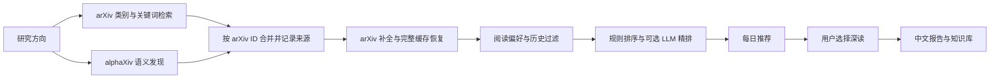

# PaperLoom 功能与配置说明

首次上手请阅读 [README 的功能 Quickstart](../README.md#web-workflow)，其中按功能列出网页入口、简短操作和截图。本文是说明文档，解释检索规则、配置项、数据范围和运行边界；终端命令、系统计划任务与云端运行见 [命令行与自动化](CLI.md)。

<a id="discovery"></a>
## arXiv 与 alphaXiv 如何协作



上图对应 `hybrid` 模式。三种模式的区别是：

| `discovery.provider` | 行为 |
| --- | --- |
| `hybrid` | 每次尝试两路发现，合并去重后补全；alphaXiv 主动扩展候选集 |
| `arxiv` | 仅使用 arXiv，适合没有 alphaXiv 凭据的环境 |
| `auto` | 兼容旧行为：仅在 arXiv 检索失败后调用 alphaXiv |

启用协作检索时，在 `.env` 中填写 `ALPHAXIV_API_KEY`，并在**当前研究方向**的 `discovery` 段设置：

```yaml
discovery:
  provider: hybrid
  alphaxiv_fallback_enabled: true
  alphaxiv_max_candidates: 15
  alphaxiv_minimum_concept_groups: 1
```

`alphaxiv_fallback_enabled` 沿用了旧配置名称，现在同时控制 `hybrid` 与 `auto` 中的 alphaXiv 开关。本项目的 alphaXiv 基础检索候选上限为 15，与 arXiv 候选上限独立；开启近期收藏引导时可额外补充最多 5 篇定向候选。API 的可用性、额度和费用以服务提供方为准。

**失败时保留可用信息。** 单路失败时仍处理另一来源的结果；arXiv 补全失败时优先复用完整本地缓存。摘要预览与未核实信息不会伪装成完整元数据，也不会把未知发布日期填成今天。两路都失败时保留已发布推荐；同日没有符合条件的新论文时，也保留已有推荐。

每次发现的来源状态、耗时与补全计数写入 `discovery-<profile>-<run-id>.json`，便于区分网络失败、空结果和筛选后无候选。

同日多次刷新会累计保留当天推荐，并按论文 ID 和修订版去重。每批原始推荐及发布前的历史副本保存在当日 `batches/<profile>/<batch-id>/` 中；邮件仍只投递本次入选论文。周报收集推荐时对同日同论文使用最高版本；有研究活动时优先纳入活动涉及的版本，阅读旧版不会借用新版摘要。原始推荐记录保持不变。

在“文献推荐 → 每日记录”选择任意已有记录的日期，再点击“清除当日推荐”并确认，可清除当前研究方向在该日的推荐列表、生成页面和批次副本。清除后自动返回最新的剩余推荐，并撤销当日论文的历史去重记录，使其可以重新参与推荐；若同一论文在当前研究方向的其他未清除日期也被推荐过，则继续保留去重。其他日期和研究方向、收藏、阅读报告与阅读进度会保留。旧版未标记研究方向的共享记录仍保留供其他方向读取，当前方向不会再显示该日记录。重新运行会使用当时的检索和排序结果，不保证恢复原来的论文列表。当前方向有推荐任务运行时需等待其结束。已导出的 Obsidian/Zotero 内容不会随之删除。

<a id="recent-interest"></a>
## 近期收藏如何影响推荐

默认启用“根据最近 5 篇收藏微调推荐”。每次推荐开始时，系统读取任务所选研究方向的收藏快照，按收藏时间取最多 5 篇，使用标题与摘要归纳近期关注点。收藏不足时使用现有论文；更新论文版本不会改变收藏顺序，移除后重新收藏视为新收藏。

基础检索继续按原方向执行，系统另加定向检索并合并去重。基础类别、概念组、屏蔽规则和推荐数量保持原设置。预筛候选最多预留五分之一名额给定向检索独有的论文，其余优先保留基础候选；任一路不足时由另一路补齐。精排依据任务所选方向，近期关注点只作为方向内的次要偏好。

在推荐详情的 **本次推荐的收藏引导** 中，可以查看参考收藏、关注点、补充检索词和发现路径。新增或移除收藏从下一次推荐开始影响结果，不会改写历史记录。相同方向与样本复用归纳结果；没有收藏、模型不可用或归纳失败时，继续基础检索。

在 **配置 → 研究兴趣与检索范围** 关闭“根据最近 5 篇收藏微调推荐”，或在当前方向配置中设置 `discovery.recent_library_enabled: false`，即可停用定向检索和收藏加分；显式屏蔽仍然生效。系统不会自动覆盖手工维护的检索配置或种子论文。

启用时会增加外部请求：arXiv 额外最多 100 篇候选，且不超过原 arXiv 候选预算；alphaXiv 在相应来源模式允许时额外最多 5 篇。精排总候选预算保持不变。归纳结果可缓存，但定向检索仍会在每次推荐时执行。

<a id="conferences"></a>
## 会议论文与长期推荐模式

打开 **会议论文**，按表单中的“会议范围 → 研究主题 → 检索选项”填写：

1. 多选 ICML、NeurIPS（含 NIPS）、CVPR、ICLR、ACL，设置起止会议年份。起止年份均包含，会议年份与 arXiv 首次上传年份独立。
2. 主题来源选当前研究方向、临时主题或不限定主题浏览目录；选择临时主题时填写相应输入框。
3. 设置本次 arXiv 关联预算，按需勾选重新获取目录和关联结果，然后点击 **检索会议论文**。

完成后刷新结果。目录覆盖与来源状态区分未公布、失败、未关联、不确定和未检查，不能把来源失败当成零篇论文。结果仅展示成功关联 arXiv 的主会正式长文，不含 Findings、Workshop、短文、Demo；提供会议来源链接，点击收藏后进入当前方向的文献库。

临时检索不改变长期推荐配置、阅读状态或已推荐记录。在方向编辑或配置页保存“最新 arXiv / 会议论文 / 混合推荐”模式后，后续每日推荐复用该范围。混合模式按 arXiv ID 合并去重后统一排序，不设置来源固定名额。

目录缓存 24 小时、关联缓存 7 天。预算限制新增关联请求，复用缓存的候选仍参与筛选，超过预算的目录记录显示为未检查。部分历史目录格式或尚未公布的届次可能无法取得，结果不保证完整覆盖；会议归属不保证 arXiv 修订版与正式出版版本内容完全相同。

ICLR 在部分情况下需要 OpenReview 登录。在 **配置 → API 与凭据** 填写自己的已注册账号与密码；保存到本地 `.env` 的 `OPENREVIEW_USERNAME` / `OPENREVIEW_PASSWORD`，登录令牌只保存在客户端内存中。

<a id="configuration"></a>
## 配置与研究方向

在“研究方向”填写暂定主题名称、主题线索、参考论文以及可选的必要条件、明确排除条件，点击“生成草稿”。模型会结合输入提炼方向名称；模型不可用时沿用暂定名称。生成不会切换当前方向；先查看名称、系统理解的主题、条件来源和同义表达，再保存或启用。草稿名称可手动修改，重新生成建议时会保留手动名称。

- 普通关键词是主题线索，不要求每篇论文全部命中。“不感兴趣的方向”默认降低优先级；必要条件与明确排除条件需要用户确认后才会阻止论文入选。
- 模型建议可修改、删除或取消采用。重新生成保留用户修改和已删除建议。仅在背景中提到排除词不等于论文属于被排除主题；无法验证的硬约束会保留解释，最终推荐可能少于设定篇数。
- 草稿按“确认主题与条件 → 试搜验证 → 启用方向”组织，条件按用途折叠。修改后先“保存修改”，避免用旧配置执行操作。“开始试搜”和“检查参考论文是否符合主题”加入后台任务队列，完成后在当前页面自动更新结果。试搜默认最近 90 天，可选 30 天、365 天或日常范围；不改变日常推荐回溯天数。结果记录查询范围、去重取回数、筛选数与来源状态，空结果与来源失败分别提示。参考检查忽略日期窗口和每日推荐的词法分门槛，逐篇显示“通过／冲突／无法判断”；试搜不会写入阅读状态、正式推荐或历史已推荐记录。编辑后旧结果会标记为过期。
- 高级区域可编辑核心、上下文和相邻主题查询分支，以及候选预算和回溯天数；重新生成时会保留这些手动修改。
- 方向页分别展示检索草稿、已保存方向和创建入口。草稿卡片可“删除草稿”，确认后移入“已删除草稿”；展开后可恢复。删除草稿不会删除已保存方向、阅读记录或报告；恢复会增加草稿版本，旧试搜结果需重新检查。

- 可跳过试搜直接“启用此方向”。仅有类别、缺少可靠主题线索的草稿需要补全后才能启用。模型或参考资料不可用时，页面显示具体原因。
- 新计划最多使用三条基础查询，核心分支至少获得一半 arXiv 候选额度，其他分支共享剩余预算；低预算时减少分支。alphaXiv 与近期关注点沿用独立限额。触及额度上限不表示已找到全部匹配论文。
- 旧方向保持原规则。可“复制为新草稿”查看条件变化，原档案保留。新版方向的主题和条件通过草稿修改，设置页只调整运行预算等参数，不覆盖已确认的计划。

草稿保存在 `profiles/drafts/`，正式方向仍保存在 `profiles/<id>.yaml`。语义硬约束依赖模型与题名、摘要证据；明确填写 arXiv 类别（例如 `cs.RO`）的条件可直接使用完整元数据验证。模型无法使用时，普通主题可采用本地排序，无法判断的硬约束不会被自动放宽。

### 配置放在哪里

| 文件 | 职责 |
| --- | --- |
| `config.yaml` | 模型、输出目录、PDF、邮件、集成、任务并行数等全局设置 |
| `.env` | API 密钥、服务地址和 SMTP 凭据；从配置文件所在目录加载 |
| `profiles/<id>.yaml` | 某个研究方向的检索与排序配置 |
| `profiles/active.txt` | 当前启用的研究方向 |

首次运行时会为尚无方向档案的项目建立默认方向。**活动方向的 `discovery` 和 `ranking` 段会覆盖全局同名段**；已有方向后，只修改 `config.yaml` 的检索字段可能不会生效。推荐通过 GUI 修改，或编辑当前方向的 YAML。完整字段见 [配置模板](../config.example.yaml) 和 [环境变量模板](../.env.example)。

关键词宜描述具体任务、方法和模态。负向关键词用于降低得分；加入文献库作为正向反馈，偏好学习仅取当前方向最近收藏的 30 篇论文。需要过滤同类论文时，可展开“屏蔽主题词”并明确填写词或短语。收藏与主题屏蔽互斥。单篇排除入口已移除，旧版本留下的单篇排除和相似主题规则保持原行为，在“反馈与筛选记录”中单独标示并可撤销。

后台任务使用**提交时的配置和研究方向**。切换方向或修改设置影响后续提交，不改变已排队任务。GUI 并行数通过 `jobs.max_parallel` 调整，范围为 1–8，默认 3。

### 任务历史与中断恢复

GUI 任务的提交内容、进度、警告、状态和结果链接会写入本地任务台账，重启后仍可从“任务 → 后台任务”查看。历史每页 25 条，首页额外保留未完成和待恢复任务。关闭或异常退出时，未完成任务会显示“已中断”，**不会自动重新执行**。

在“任务 → 后台任务”点击“清除已结束记录”，确认后可删除成功、失败、取消及已中断的任务记录。排队中和运行中的任务会保留；已生成的报告、推荐页面和其他结果文件不会删除。清除后，原任务不再能从任务列表恢复。

切换到任务原来的研究方向，点击“重新执行”（报告为“继续全文分析”）可创建关联的恢复任务，原记录继续保留；重复点击不会再创建同一次恢复任务。恢复使用保存的配置，可能再次调用模型和已配置的同步，具体行为如下：

| 任务 | 恢复行为 |
| --- | --- |
| 完整阅读报告 | 使用所选快照或首次执行已解析的论文版本；若无版本 ID 尚未解析，则重新查询。校验后复用已保存解析、分片与整合结果，保留旧产物 |
| 每日推荐 | 保留原检索配置和强制刷新选项，重新检索并应用当前阅读偏好；恢复时不发送邮件，避免重复投递 |
| 研究活动周报 | 保留原统计截止时间和个人笔记选项，重新读取符合截止时间的本地活动与资料；实际生成时间另行记录 |
| 跨论文比较 | 使用原论文版本和提交时的证据快照重新生成 |
| 版本同步批次 | 继续原批次，跳过已完成论文并复用已有步骤记录 |

报告任务页显示解析、已完成分片数和整合状态。模型失败后生成的摘要级回退报告仍可打开，同时提供“继续全文分析”。已完成的模型响应先保存再进入下一步；若全部分片已保存而整合失败，恢复只需继续整合。新提交的报告独立生成，仅原任务的恢复链共享中间结果。

复用前校验论文快照与方向、PDF 内容、解析结果/设置，以及模型名称、实际服务地址、温度、分片大小和具体文本提示词。图片解释还校验图片内容、标题、摘要和图注。输入变化、缺失或损坏时提示并重新执行相关步骤。恢复仍使用原提交配置；需要采用修改后的模型配置时，请新建报告任务。

中间结果保存在私有 `.jobs/report-work/`，包含全文、图片与模型输出，不能从产物接口下载。它们是可重建缓存，**不包含在当前备份包内**；备份恢复后的任务保留历史，但缺少中间文件时需重新处理。原报告与结果链接不会被恢复任务覆盖。元数据核验和 HTML 方法图获取仍会执行；已配置的外部同步可能重复。不保证正在请求但尚未落盘的响应可以复用，也不承诺外部写入精确一次。

其他 GUI 任务也保留历史，但需从各自功能入口重新提交或继续。分步骤恢复首版仅接入 GUI 单篇报告，未扩展到独立 CLI 报告、每日任务内的报告或批次内部报告；版本同步批次继续使用原有步骤记录。程序升级前未保存的中间结果无法补回。

同一输出目录同时只允许一个 GUI 队列运行；关闭 GUI 后仍在执行的工作结束前，目录继续由原队列占用。台账位于输出目录的 `.jobs/`，不通过产物下载接口提供；密钥等环境变量配置保留变量名称，不复制运行时变量值。CLI 独立命令尚未接入通用台账，版本同步批次原有恢复机制继续可用。

### 备份与恢复

打开 **配置 → 备份与恢复**。备份覆盖全部研究方向，默认包含配置、方向档案、收藏、阅读进度、笔记、反馈、推荐 JSON、版本状态/批次和 GUI 任务台账。可以分别勾选报告及配图、本地 PDF、`.env` 凭据。PDF 单独勾选时保留相应元数据。搜索索引、锁文件、程序代码、外部 Zotero 库和 Obsidian vault 不纳入备份。

备份 ZIP 保存在项目的 `backups/`，包含版本化清单、文件大小和 SHA-256，生成后校验成功才发布。`.env` 默认不包含，也不会读取进程中的环境变量值；勾选后凭据会**明文**写入 ZIP。即使不包含 `.env`，配置和笔记仍可能含有私人信息，因此备份不是脱敏分享包。

恢复采用“校验 → 预览 → 执行”流程：粘贴本机 ZIP 完整路径，填写恢复目录名称，选择保留现有文件或替换冲突文件。页面列出新增、相同、保留、替换的数量及全部文件。备份或目标在预览后变化时拒绝执行，要求重新预览。

第一版恢复到当前项目的 **`restored/<名称>/` 独立目录**，不覆盖当前运行环境。输出配置迁移为 `run`，任务/版本批次配置中的项目与输出路径及版本状态中的报告路径随之调整；外部同步连接、vault 路径和其他配置值保持原值。已有恢复目录会先完整保留在相邻的 `<名称>-before-.../` 中，然后发布新目录；备份之外的现有文件继续保留，冲突按文件处理，不合并 JSON 字段。复制前后检查目标内容，运行中的标准恢复副本 GUI 会通过目录外占用锁阻止替换。

检查完成后可运行 `paperloom --config "restored/research-copy/config.yaml" gui --port 8001` 启动副本。未包含 `.env` 的新目录需要另外配置凭据；搜索索引需重建。中断任务不会自动执行，外部同步不会因恢复本身触发。使用任务恢复或同步前，请检查迁移后的外部连接配置。

也可使用命令行（`--config` 指向当前项目配置）：

备份和恢复期间请停止 CLI 写入及编辑，先等待后台任务完成，并关闭目标恢复副本的 GUI。文件变化会导致操作中止；此功能不提供跨外部进程的文件系统快照。若恢复进程在目录交接时退出，页面会提示“整理中断恢复”：目标缺失时放回旧目录，已发布的目标保留，暂存资料不删除。首版最多 10 万文件、总计 20 GiB、单文件 2 GiB；校验和预览会完整读取备份。只支持此版本化格式，拒绝路径穿越、Windows 特殊路径、大小写冲突、符号链接及加密 ZIP。

### 报告阅读与核对详情

阅读报告保留正文中的 PDF 页码链接和简短核对提示，不再在文末重复全文摘录或逐条复述“原陈述”。跨论文比较保留比较矩阵、可比性说明及来源入口，不再展开“条目依据与待核对原因”和“固定证据摘录”。详细记录仍保存在 `evidence.json`、`sources.json` 和 `matrix.json` 中，通过报告末尾链接按需查看；精简展示不改变数值核验规则或“证据不足”的判定。

应用内打开历史报告时也会使用精简展示，原 Markdown 和证据文件保留。新生成的 Markdown 同样精简；Obsidian 同步会精简历史报告附录，并复制和链接已有的核对详情。磁盘 HTML 使用本机安装目录中的公式与样式资源，可直接打开；单独搬走 HTML 不构成包含所有依赖的离线导出。

“本地报告”按 arXiv ID 每篇只显示一条，优先显示较新版本，同版本优先显示全文报告。论文下方列出曾生成报告的研究方向，可用方向下拉框筛选；重新生成的旧文件仍保留在本地作为历史产物。点击“删除报告”并确认后，会删除该 ID 的所有本地报告目录（包括 PDF 和方法图），但不会移除各方向的文献库收藏。

### 本地全文与笔记搜索

从主导航打开“搜索”，在当前研究方向点击“更新索引”。任务完成后刷新页面，即可检索标题、摘要、个人笔记与标签、单篇报告正文，以及报告目录和版本同步目录中已有 PDF 的可提取文字。检索与索引均在本机完成，不调用模型、不下载 PDF，也不向外部服务发送笔记。

- 支持中文短词、英文大小写和全角字符归一化。空格分隔的关键词须同时命中一个段落或其标题；按材料类型、报告质量和修订版筛选。切换研究方向即可检索另一方向，无方向的历史材料按原有共享规则可见。
- 每份材料显示一个命中段落，每页 20 条。点击结果查看原样文本及来源；PDF 可跳到固定材料的物理页。笔记以实际阅读版本标注，移出文献库后保留的笔记仍可检索。
- 索引是上次更新时的快照。新增报告、修改笔记或移除材料后，请再次更新索引并刷新页面；打开命中段落时会检查来源是否变化，变化后要求重新索引。更新按文件大小和修改时间复用未变化的材料，失败或取消不会发布半成品索引。
- 扫描页、无法提取文字的页面和损坏 PDF 会显示提示，不执行 OCR。首版暂不索引周报、比较产物和外部 Zotero / Obsidian 文件，不提供语义搜索或问答。短词搜索会扫描已索引段落，尚未进行大规模性能基准。

派生索引位于输出目录的 `.search/`，按方向隔离，包含本地笔记文本，不能通过产物下载接口访问。索引可以通过“索引维护与范围 → 重建全部索引”重建，原始材料不变；需要 Python 自带 SQLite 支持 FTS5 trigram（SQLite 3.34+）。索引任务保留任务历史，中断后从搜索页重新提交，不自动执行。

### 模型与外部服务

项目使用 OpenAI-compatible Chat Completions，可接入兼容的远程服务或本地端点。将 `.env` 中的 `LLM_API_KEY`、`LLM_BASE_URL` 与 `config.yaml` 中的 `llm.model` 配套设置；模型名应以实际服务可用的名称为准。

```dotenv
# 远程兼容服务；使用 SDK 默认服务地址时可留空 BASE_URL
LLM_API_KEY=your-api-key
LLM_BASE_URL=

# 按需填写
ALPHAXIV_API_KEY=
OPENALEX_API_KEY=
SEMANTIC_SCHOLAR_API_KEY=
```

本地 Ollama 可将 `LLM_BASE_URL` 设为 `http://localhost:11434/v1`、`LLM_API_KEY` 设为 `ollama`，并将 `llm.model` 设为本机已准备的模型名。图示解读还需要模型支持图像输入，普通文本模型无法替代视觉能力。

OpenAlex 与 Semantic Scholar 用于出版信息核验；未配置凭据或请求失败时，能否返回结果取决于服务端策略。请将 `metadata.openalex_email` 改为自己的联系邮箱。不要将 `.env` 或真实凭据提交到仓库。

## 阅读与研究材料

### 报告与版本

推荐详情中的“查看匹配词与分数构成”展示运行时命中的关键词、类别、概念组以及词法、模型、反馈分。综合分用于排序，不是相关性概率。旧推荐未记录的解释不会按当前配置补造。

推荐页的“反馈与筛选记录”可查看当前方向的排除规则并撤销。若排除操作移除了原收藏，撤销会恢复收藏，个人阅读记录始终保留；已在其他页面变更的反馈会拒绝过期撤销。撤销不改写历史推荐或已导出的 Obsidian 内容，后续推荐按新规则筛选，历史去重仍然生效；需要重新推荐曾入选的论文时可使用 `--force`。

每次推荐新增独立的筛选快照，记录入选、主题屏蔽、历史去重、概念组不足、预筛数量和评分/名额限制。页面可切换最近 100 次记录。快照只解释检索源实际返回的候选，无法解释未被召回的论文。新生成的解释和筛选页面均使用本地记录，查看时不调用模型。

文献库中的“阅读记录”可编辑进度、标签、个人笔记和阅读修订版；搜索同时覆盖笔记与标签。阅读状态独立于收藏偏好，收藏同步到新版后仍保留读过的旧版。取消收藏或标记不相关不会删除个人记录，重新收藏后可以继续查看。笔记保存不调用模型；多个页面编辑同一记录时，过期提交会提示冲突并保留输入内容。

页面操作绑定其显示的研究方向；其他标签页切换方向后，旧页面需要刷新再提交。历史推荐收藏使用所选日期和修订版，报告收藏使用具体报告；重复加入旧快照不会降低已有收藏版本。

报告库标注全文分析、摘要级回退或历史质量未记录，并显示已记录的模型、解析页数和运行提示。可从列表补生成所选修订版。每次生成保存为独立产物，保留旧报告；同方向同版本的证据读取优先使用完整报告。“全文分析”表示执行路径，不代表结论已经逐条核实。

新报告会要求模型保留重要陈述的连续原文摘录，系统在对应版本的 PDF 文本中定位，唯一匹配后才生成 `[1]` 这样的短引用；点击编号可打开 PDF 对应物理页，摘录与页码保存在 `evidence.json`。过短、虚构、多页重复或无法提取的摘录不会生成已校验引用。报告末尾列出可定位文本页数、PDF 总页数和缺少已定位摘录的关键章节；报告库也展示引用数量。**摘录定位不等于结论正确性核验，也不是全文内容覆盖率**。扫描页、OCR 差异及跨页摘录可能无法匹配；旧报告需重新生成才会获得这些记录，查看旧报告不会自动补生成。

新报告在“一句话总结、为什么值得阅读、主要贡献、实验设置、关键结果、可复现性”中检查含数值的段落或表格行：是否有同段已定位摘录，数值与已识别单位是否在摘录中出现。百分比与百分点、秒与毫秒分开核对，不自行换算或计算提升。表格另检查模型行与数值顺序；来源具有明确、唯一的平面表头时，进一步对照指标列、表头单位/缩放标记和明确列出的实验条件。

数值引用没有定位到、摘录不完整或表格无法解析时，保留原有段落和数值并明确标注“待核对”，不能把定位失败等同于数值错误，也不能据此删除解释文字。只有检测到明确模型行、指标列或实验条件冲突时，才将对应单元格改为“—”；它不代表零或论文未报告。已引用片段截断原文数据行时，仅在唯一模型行与片段相交、行顺序或列检查通过时补充精确整行引用，不从其他页面或相邻模型借数值；`k` 后缀原样核对。原始内容、核对原因、实际发布策略及标记/隔离统计存入 `evidence.json`。“待核对”内容不是已经证实的论文结论。

多级/损坏表头、数字粘连、别名、复杂公式、无法唯一确定的条件，以及一般语义蕴含仍可能无法核对。只完成数值出现检查或模型行/顺序检查的表格不会标为已完成指标核验，也不会仅因程序无法解析便全部清空。**没有提示不代表结论正确**；扫描/截断 PDF 没有可用页面文本时，不标为已完成摘录校验。

数值核对仅检查报告**已经写出的**相关段落和表格行。为防止整合丢表，分片分析要求保留完整 Markdown 表格；程序再比对分片表格和最终报告，只将被整合省略的行连同条件、引用以“分片摘录”补回关键结果，随后接受同一数值审计。PDF 表题目录用于检查更早阶段的遗漏；未按表号匹配或仅有摘录的表列在末尾索引，未匹配也可能是报告用了别的标题。图片和标题本身不算重现。即使有 Markdown 表格，程序目前也不能证明原文所有行、脚注和实验条件均已复刻，因此报告库将表格完整性列为人工核对项。`evidence.json` 中的 `publication_gate` 区分来源已定位、数值待核对和明确归属冲突；它检查可追溯性及有限的字面一致性，不判断论文原文是否正确。扫描页、无标准表号或未被分片提取出的表格仍需核查，不能承诺任何论文都自动完整提取。

旧报告可通过 `python scripts/recover_report_content.py run` 预览从已保存审计恢复内容，添加 `--apply` 后应用。每份报告先备份至 `.jobs/content-recovery-backups/`；能唯一匹配的内容原位恢复，重复或合并的占位符对应内容放入“待核对内容恢复”部分，不猜测原位置。该操作不调用模型，不把未核实内容标成已核实，也无法恢复从未生成或从未保存的内容。

报告 HTML 通过白名单净化，并使用独立的公式/交互脚本。GUI 打开有 Markdown 源文件的旧报告时，会在本地安全呈现，不修改旧文件或调用模型。直接从文件管理器打开旧 HTML 不经过这一保护，推荐使用 GUI 的报告入口。

报告、周报、跨论文比较与版本报告共用 CommonMark 解析入口，支持正文后直接接列表、嵌套列表，以及表格与公式混排。保存 HTML 前自动检查已识别的列表、表格、公式结构和目录目标；发现结构丢失、未解析的列表/表格或多余表格单元格时，会明确报错并停止发布该 HTML，保留已生成的 Markdown。此检查用于排版完整性，不代表论文结论或数值已核实。

| 入口 | 版本规则 |
| --- | --- |
| 历史推荐或文献库中的“生成报告” | 使用所选记录的版本，在提交任务时捕获快照 |
| 在生成页面或 CLI 输入无版本 ID | 查询最新数据；请求失败时可使用本地数据，并注明未确认最新版本 |
| 显式输入 `v2`、`v3` 等后缀 | 严格匹配指定版本，不以其他修订版替代 |

没有可靠版本号的历史记录会提示改用直接输入 ID。已知版本的元数据、PDF 和 HTML 配图使用同一修订版；不同方向、不同版本的报告分别保存。

完整报告覆盖基本信息、研究价值、问题背景、核心方法、贡献、实验与结果、对比、局限及可复现性。方法图优先从 arXiv HTML 获取，缺失时尝试 PDF 提取；无法可靠提取时跳过。HTML 报告包含目录与本地 KaTeX 公式渲染。模型或全文解析失败时会输出带提示的回退结果，其深度不等同于成功完成的全文报告。

### 研究活动周报与跨论文比较

- **研究活动周报**：在周报页查看本期收藏、标记已读、报告生成、版本更新和笔记更新，结合近期推荐与精确版本的可用报告生成综述。默认统计最近 7 天，可通过 `weekly.days` 调整。即使没有新推荐，也能汇总本期研究活动；达到论文数量上限时优先纳入有活动的论文，活动附录仍保留完整记录。
- **个人笔记**：默认不附入周报。勾选“将本期个人笔记与结论附入周报”或使用 `--include-notes` 后，附入本期各论文最后一次笔记更新，标明阅读版本。内容在模型生成后本地追加，不发送给模型；已配置周报自动同步到 Obsidian 时，附录也会同步。升级前未保存的历史行为或笔记旧稿无法还原。
- **跨论文比较**：从报告库、文献库或周报页进入，搜索并选择当前方向本地已有的 **2–5 篇不同论文的指定版本**。支持填写比较关注点；按研究问题、核心方法、数据与任务、实验条件、关键结果、局限性和复现成本生成矩阵。
- **比较依据**：优先采用精确方向与版本的完整报告、已定位原文摘录；没有报告时使用可用摘要，缺失信息标为待核对。每个保留条目必须提供同论文来源和该来源内的连续支持摘录；核对详情保留摘录与拒绝原因。数值需要摘要或原文摘录支持，仅引用模型报告不能确认为数值依据；仅依据报告的非数值内容标为推断。数值/单位不匹配、伪造摘录、明确的跨论文排名及重复论文条目会转为证据不足。检查不验证语义蕴含，实验条件与指标归属仍需人工核对，不能据此直接排出论文优劣。
- **生成与留存**：比较提交时固定材料，个人笔记和标签不进入比较模型；不会自动下载或补生成单篇报告。周报和比较每次生成均保留独立目录及来源快照，后续新版不会改写旧产物。未配置模型或模型失败时，比较仍保存材料清单和待核对矩阵。

### 版本追踪与图谱

- **版本追踪**：从已收藏论文、已同步文件、配置启用的本地报告与 Zotero 来源收集论文，排除“不相关”论文。首次检查建立远端基线，同时展示收藏、本地 PDF、报告与远端版本；后续版本上升时生成差异记录。`max_tracked` 是每轮检查数量，超出的论文在后续轮次检查。单篇失败不阻断其他论文，差异分析失败仍保留新版发现记录。
- **主动同步**：在“追踪”页输入无版本后缀的 arXiv ID，或点击论文卡片上的“同步最新版”。默认下载指定修订版的元数据与 PDF，并推进已有收藏的当前版本。可勾选生成报告、添加 Zotero 新版附件、更新 Obsidian 笔记；旧版文件和历史推荐保留。各步骤单独记录结果，失败后可继续原版本的未完成步骤。
- **相关工作地图**：以起点论文发现下一篇值得阅读的工作，组合 Semantic Scholar 的参考文献、引用论文与近期推荐。默认最多收集 150 篇候选、展示 50 个节点、发出 20 次请求（含重试）；在配置页可分别调整候选、展示和请求额度，已有来源数量设置保留。

地图默认使用标题与摘要的词汇相似度，允许没有可靠关联的独立节点。点击论文或连线查看共同词、引用方向和已取得的共同参考文献。引用箭头从引用方指向被引用方；服务推荐只是候选来源。分数只适用于当前快照，缺摘要、未知年份与不支持的文本均有提示。

顶部“数据状态”分别说明各来源的获取时间、缓存回退和截断情况；近期推荐池并不代表完整跨年份覆盖。地图跟随提交时的研究方向，已标记不相关的普通候选被排除；没有明确条件时使用本地计算；有明确条件且已启用模型精排、配置模型时，复用该模型分批判断并验证原文依据，请求和兼容重试计入同一总额度。未配置模型、额度不足或依据不足的候选列入“待判断”；已证实不符合条件的候选被排除。起点始终保留为参照，并说明已知冲突或依据不足。

可切换“内容探索”和“引用脉络”，搜索标题/作者，按来源、年份与引用数筛选。起点不计入筛选命中数。选择与筛选保持布局位置；缩放、适应画布、定位起点和重置视图位于画布下方。窄屏使用“查看论文列表”和可关闭详情面板，核心关系也能通过键盘在列表与详情中查看。

每次重新生成先准备完整快照，再切换图谱库入口；失败或取消保留上次完整地图。关闭生成功能后仍可打开已有结果。历史图在应用内使用兼容展示并标记缺失状态，不改写原文件；独立旧 HTML 不会自动升级。新图附带本地样式和脚本，可直接在本机打开，备份报告时也会包含这些资源。

同步任务在开始时向 arXiv 确认最新修订版并固定目标；查询失败不会以缓存冒充最新版。重试会复用原目标和已选择的步骤，即使远端又出现新版也不会串版。报告回退为摘要级时显示“可重试”；本地同步已成功但外部同步失败时显示“部分完成”。完成任务后点击“刷新版本状态”查看最新卡片。

Zotero 同步向已有条目补充新版附件，保留原附件和人工编辑的条目字段；需启用 PDF 附件设置。Obsidian 保留手写内容，新版附件放入对应方向和修订版目录。支持手动单篇及批量同步，自动下载策略尚未启用。

**批量同步**：在“追踪 → 待同步清单”勾选论文，选择报告及外部同步项，再点击“预览批量同步”。预览列出固定目标版本、下载/校验数量、至多生成的报告数量和同步目标；默认只处理元数据、PDF 和已有收藏。每批最多 200 篇。清单依赖最近的版本检查，未知远端版本的论文需先检查。

开始后按论文顺序执行，单篇失败不阻断其他论文，可从后台任务取消。在“批量同步记录”展开批次，查看逐篇结果并“继续未完成论文”；已完成论文会跳过，失败论文复用已成功的步骤。记录保存在本地，重启后仍可继续原批次；版本、方向、模型及外部目标沿用预览时的设置。若要更换这些设置，请创建新预览。报告生成及 Obsidian 笔记摘要可能涉及多次模型调用，预览篇数不是调用次数。当前显示最近 20 个批次，并额外保留所有未完成的执行批次入口。

**按方向自动同步**：在“追踪 → 自动同步”开启“检查后自动同步”，设置每轮篇数并保存。默认关闭，保存本身不启动任务；后续 GUI“检查新版本”、CLI `versions` 和每日任务中的版本检查完成后，自动下载已知最新版 PDF、元数据并更新已有收藏。每日执行仍依赖已配置的每日任务及 `version_tracking.auto_check`；本功能不另建定时器，也不会自动轮流运行所有方向。

报告、Zotero、Obsidian 分别选择，默认不启用。默认每轮最多同步 10 篇；开启报告或 Obsidian 时，再受每轮 2 篇模型处理上限约束（取较小值），整篇的所选步骤一起处理，余下留待后续检查。此外默认最多发出 20 次模型请求，包含图像解读和参数兼容重试；在该范围内关闭 SDK 隐式重试，以确保请求次数受限。达到上限后不再发出模型请求，受影响步骤标记为可继续，已下载文件保留。请求数不是 token 或费用上限；独立的版本差异分析不计入同步额度。

自动批次与手动批次共用持久化记录。失败、取消或进程中断的自动批次不会在下次检查时反复重试同一论文修订版，可在“批量同步记录”手动继续；每次手动继续重新分配原请求额度。目标版本、模型和外部目标仍沿用原批次，修改或关闭策略仅影响后续新任务，运行中的任务需另行取消。策略保存在当前 `profiles/<id>.yaml` 的 `version_sync` 段，其他方向默认关闭；无研究方向时才使用 `config.yaml` 中的策略。

<a id="integrations"></a>
## 可选集成

### Zotero

通过 Zotero Desktop 的本地 API 保存单篇或批量论文，支持分类选择、条目去重、研究方向标签、摘要笔记及报告附件。

启动支持本地写入授权的 Zotero，启用允许本机应用通信的设置，然后在 GUI“配置 → Zotero”中连接并授权。授权凭据保存在本机 `.env` 的 `ZOTERO_LOCAL_API_KEY`，此流程不使用 Zotero 云端 API key。

PDF 支持 `imported_file` 与 `linked_file`：前者导入 Zotero 存储，后者链接本地文件。移动项目目录后，本地链接可能需要更新。批量保存历史推荐时，处理的是页面所选日期的论文。

### Obsidian

指定已有 vault 路径即可同步每日推荐、论文笔记、阅读报告、周报和主题索引，无需专用 Obsidian 插件。

```yaml
obsidian:
  enabled: true
  vault_path: 'D:\YourVault'
  root_folder: PaperLoom
  auto_sync: true
  copy_figures: true
  copy_pdf: false
```

应用更新笔记的托管区块，保留区块外的个人笔记；无托管标记的同名文件会使用备用名称处理。图片可复制到 vault，PDF 默认不复制。同步不会自动执行 Git 提交或推送。

重同步保留托管区块前后的正文与自定义属性；托管标记损坏或属性无法解析时停止写入该文件。同一论文的笔记按研究方向隔离，图片与 PDF 按方向和修订版分别存放。旧索引在对应方向同步时迁移并复用原笔记路径，旧附件保留。摘要和周报只读取方向及修订版匹配的报告；缺少精确版本时不借用其他修订版的报告。

### SMTP 邮件

配置模板使用 QQ SMTP，可在全局配置中调整 SMTP 参数。启用邮件后，在 `.env` 填写 `QQ_EMAIL` 和 `SMTP_PASSWORD`；QQ 场景下使用邮箱生成的 **SMTP 授权码**，而非登录密码。

默认将邮件发送给配置的自身邮箱；自定义收件人使用 `delivery.to_addresses`。邮件测试命令见 [命令行指南](CLI.md#常用命令)，测试会实际向配置的收件人发送邮件。

<a id="automation"></a>
## 定时运行

**多研究方向调度**

从 **方向 → 多方向调度** 设置每个方向的时间、IANA 时区、星期及邮件选项，再启用自动调度总开关。新安装默认全部暂停；保存或重新启用后，仅保存时间之后的时段生效，不立即补跑当天已经过去的时段。计划明确绑定方向 ID，不依赖最后活动方向，也不会切换 GUI 方向。每天最多自动登记一次，修改时间不重复执行当天已登记的计划。

调度运行该方向的每日检索、筛选和推荐日报流程；周报、版本检查和同步仍遵循现有配置，可能使用模型及外部服务。它不会自动为每篇推荐生成深度报告，需从推荐页提交或使用 `report` 命令；缺少可靠版本号的推荐需先通过生成页面解析最新版本，不能当作已固定版本。邮件需同时满足方向计划勾选和全局邮件已启用。多方向共享后台任务并行数；同方向已有推荐任务在运行/排队时暂缓自动提交，仍受补触发窗口限制。暂停总开关或方向只停止后续提交，已排队任务需到任务页取消。

GUI 保持运行时每 30 秒检查。未运行或休眠造成错过时段时，恢复后两小时内允许补触发，超过则记录“错过时段”，不补跑历史日期。计划时间是入队时间，实际执行可能受队列延迟影响。夏令时不存在的本地时刻跳过，重复的本地时刻仅取第一次。失败、中断、取消均不自动重试；需要时从任务页手动恢复，恢复推荐任务不发邮件。

GUI 与独立调度进程使用同一队列占用锁；已有 GUI/调度进程运行时，第二个 `schedule` 入口跳过。状态保存在输出目录的 `schedule-config.json` / `schedule-state.json`，任务仍写入 `.jobs/`。配置/台账损坏时停止相应调度并显示异常，原文件保留。记录先落盘再提交，不承诺外部写入“精确一次”；不确定是否执行的中断时段不会自动重跑。

备份会包含计划与执行记录；**恢复副本始终暂停调度**，即使备份中的开关已启用，也必须在副本页面明确重新启用。现有手动 `run` 命令及旧定时入口不参与这套时段去重；使用多方向调度时请升级或暂停旧入口，避免两套入口同时运行。

需要服务窗口之外的调度入口时，见 [Windows 计划任务与 GitHub Actions](CLI.md#automation)。

## 数据与隐私

本地优先意味着**配置和成果由你保存与管理**，不意味着所有计算都离线。启用远程模型后，相关论文标题、摘要、正文片段、研究兴趣及用于图示解读的图片可能被发送到所选服务；检索和元数据核验也会访问对应外部 API。

默认输出目录为 `run/`，主要结构如下。部分文件仅在相应功能运行后生成：

```text
run/
├── .jobs/                           # GUI 任务台账、请求快照与队列占用锁
├── reading-state-<profile>.json       # 收藏、反馈、阅读笔记与活动记录
├── state-<profile>.json               # 推荐去重历史
├── version-state-<profile>.json       # 版本追踪基线
├── papers/<profile>/<arxiv-id>/       # 主动同步记录与按 vN 保存的 PDF/元数据
├── version-batches/<profile>/<id>/    # 批量预览、固定配置与逐篇执行结果
├── metadata-cache/                   # 完整论文元数据缓存
├── YYYY-MM-DD/
│   ├── recommendations-<profile>.json
│   ├── candidates-<profile>.json
│   ├── discovery-<profile>-<run-id>.json
│   ├── index-<profile>.html
│   └── reports/<arxiv-id>-v<n>-<profile>-<title>/
│       ├── report.md
│       ├── report.html
│       ├── metadata.json
│       ├── paper.pdf
│       └── method-figure-*.png
├── weekly/<year>-W<week>-<profile>-<attempt>/  # 周报、活动与来源快照
├── comparisons/<date>-<profile>-<attempt>/   # 比较报告、矩阵与证据快照
├── versions/<profile>/<arxiv-id>/v<n>-to-v<m>/
└── citations/<arxiv-id>-<profile>/
```

兼容文件 `recommendations.json` 与 `index.html` 仍可能存在，多方向读取应使用方向专属文件。图片也可能采用 PNG 以外的格式。

升级前请备份 **`.env`、`config.yaml`、`profiles/` 和输出目录**。旧收藏与反馈文件会在首次修改时导入统一阅读状态，原文件保留；迁移后旧文件不再更新，不应让旧版本程序继续向同一目录写入。

Web 界面默认绑定 `127.0.0.1`，凭据不回显；所有请求校验本机 Host，修改请求拒绝跨站、空来源（`Origin: null`）和非法来源。日常请使用 `127.0.0.1` 或 `localhost` 打开，不支持自定义域名反向代理。不要将它当作已经具备认证与隔离能力的多人公网服务部署。

<a id="faq"></a>
## 常见问题

**代理下载 PDF 反复在 1 MiB 处断开，或直连 PDF 返回 406？** 在 Windows 上可先停止 GUI 服务，再运行 `scripts\start_gui_pdf_direct.cmd`。该入口设置 `ARXIV_PDF_BACKEND=curl-direct`，使用 Windows 系统 `curl.exe` 直连下载 PDF；API、模型和其他服务仍使用现有配置。也可在 `.env` 设置同名变量后重启，已有进程变量优先。PDF 按 1 MiB 分段下载，请求间隔至少 3 秒；校验响应范围、文件大小和 Last-Modified，失败时退避重试当前分段。任务显示已下载大小和平均速度，并在下载期间检查取消请求。此选项不能绕过代理软件的 TUN 接管，也不能保证远端服务永远可用；默认后端仍为 `httpx`，设回该值即可恢复。若此前为排错设置了绕过整个 arXiv 域名的 `NO_PROXY`，需要移除对应项才能让 API 重新使用代理。

**arXiv 返回 429，换了出口还需要限速吗？** 需要。先确认 Python 进程的代理、出口与目标 API 连通性；浏览器能打开网页不代表 API 请求使用同一路径。客户端保留请求节流、退避和 `Retry-After` 处理，可用出口也不能保证所有限流都消失。

**Semantic Scholar 的所有端点如何共用每秒一次额度？** 元数据与引用图谱共用 `semantic-scholar` 限速器。请求之间至少保留 1.2 秒，同一用户下的 GUI、CLI 和项目副本通过本机文件锁共享请求间隔与 429 冷却状态；每次重试也申请额度。改动需重启已有服务才能生效。其他软件、其他用户或其他电脑使用同一 API Key 时不受本机限速器控制；遵守间隔后仍可能收到远端 429，应继续退避而非并发重试。

**开启 `hybrid` 后看不到 alphaXiv 候选？** 检查当前方向的 provider、启用开关与 API key，再查看当次 discovery manifest。API 失败、候选重复、缺少发布日期、得分不足或被历史过滤，都会影响最终入选结果。

**为什么刷新后还是原来的推荐？** 当日没有符合条件的新论文时会保留已有结果。需要忽略已处理历史重新筛选时，在任务页勾选强制刷新选项；它不会绕过所有评分与偏好规则。

**为什么报告只有摘要级内容，或没有方法图？** 可能是模型未配置、全文下载或解析失败，或没有可靠的图片提取结果。查看报告中的运行提示，分别排查模型、PDF 和 HTML 获取情况。

**修改配置后没有生效？** 检索与排序可能被活动方向覆盖；已排队任务使用提交时的配置。修改 `output_dir` 后还需重启 GUI，才能重新挂载产物目录。

**“已核验”的出版信息能代替原始来源吗？** 不能。arXiv 首发时间不是正式发表时间；外部元数据可能延迟或冲突，arXiv 中作者声明的发表信息也会单独标注。报告属于辅助阅读材料，关键数字、结论和引用信息仍应核对原文。

## Zotero 与 Obsidian 收录回执

推荐、收藏库和报告提供“收录与同步”入口。先确认论文修订版及所选报告，再分别选择 Zotero 或 Obsidian；现有单独保存按钮仍可使用。收录不会改变收藏或阅读状态，也不会生成新的阅读报告。未知修订版的论文可保存元数据，但启用 PDF 时需先确认指定版本。

每次操作保留逐目标回执，包含处理结果和资料位置。已有可靠关联时，论文旁可直接打开 Zotero 条目或 Obsidian 笔记。Zotero 不可用、附件上传失败或笔记标记损坏时，查看回执并继续未完成步骤；批量保存也保留逐篇结果。Zotero 的服务错误不会被当作查重无结果；仅标题相同或存在多个匹配时，需要选择对应条目。

收录页也会只读识别旧的 Obsidian 自动导出笔记：根据导出索引核对论文、研究方向和托管标记，显示已有笔记与版本，但不补造历史操作记录。关联与收录记录是两回事，因此“已有笔记”和“还没有收录记录”可以同时出现。Obsidian 保存位置中的“知识库根目录”对应配置的 `root_folder: .`，不是文献条目 key。

移动 Obsidian 笔记后使用“检查 / 修复关联”。应用只在配置的专用目录中寻找同论文、同研究方向的托管笔记。外部资料删除后不会自动重建，需明确重新收录；手写区和自定义属性继续保留。更换目标配置后，重试需明确使用原配置，或从论文按新配置收录。恢复目录中的外部关联先等待验证。

收录回执保存在输出目录的 `collaboration.json`，包含在常规备份中。历史版本同步记录显示为待验证记录，可通过检查关联接续使用。批注和个人笔记回流、双向编辑及删除传播不在本次功能范围内。

协议参考：[Zotero Local API](https://www.zotero.org/support/dev/web_api/v3/local_api)、[Zotero 条目跳转](https://forums.zotero.org/discussion/78312/zotero-uri-vs-select-item)、[Obsidian URI](https://obsidian.md/help/uri)。
# 论文阅读对话

在推荐或文献库的论文条目点击“阅读对话”，需要该论文已有对应版本的本地报告；没有报告时入口不可用。点击会打开仅引用该论文的新会话草稿，首次发送问题后进入历史，不会覆盖已有讨论。也可从导航进入独立阅读页，点击“添加论文”，搜索报告库并一次选入一篇或多篇论文。

独立阅读页在输入框上方缩略展示引用论文，可在同一会话中增删；“添加论文”弹窗同步当前引用，支持全选当前搜索结果和取消勾选，点击“保存引用”生效，关闭则丢弃未保存修改。助手只查阅所选论文的报告及对应版本原文，不自动加入参考文献。使用“交叉对比”可比较研究问题、方法、实验设置和局限，每轮保存当时的引用范围，回答中的原文依据注明论文身份。移除引用不删除历史讨论，若需排除此前讨论的影响，请新建会话。

左侧历史按会话最近活动排列，支持按会话标题、论文标题、arXiv ID、提问或回答搜索，并显示命中片段；多个空格分隔的关键词需全部匹配。支持重命名、单条删除和批量删除，全选只作用于当前搜索结果；旧单篇会话仍可查看。引用版本不会随报告更新自动切换，暂不支持同一论文不同版本并列比较。报告被删除或版本改变时，历史问答保留；继续提问或重试前，需要恢复对应报告或移除失效引用，至少保留一篇有效引用。

阅读报告时，点击顶部“阅读对话 / 提问选区”打开右侧单论文对话面板；先选中正文再点击，可将选区作为问题材料。侧栏保持当前报告的问答、平铺历史和宽度调整，多论文研究在独立阅读页进行。直接打开静态报告时，对话入口指向默认本地服务端口 8000；自定义端口请在对应服务进入。

Enter 发送，Shift + Enter 换行。输入区下方可新建会话、添加图片或打开模型设置。每条回答支持复制，“查阅过程”显示搜索、读取页面和核实摘录的步骤。新会话首次提问后以问题作为标题。

“阅读模型设置”默认复用项目模型，也可独立配置兼容 OpenAI 的服务地址、模型和密钥。模型需要支持工具调用；图片提问还需支持图片输入。可粘贴截图或选择最多四张 PNG、JPEG、WebP 图片，每张不超过 5 MiB。独立密钥保存在本地环境配置，不随聊天记录保存。

助手按需获取指定版本 PDF、搜索及读取页面；论文具体结论可通过正文中的原文页码链接跳转原文物理页，不再另设回答末尾的“原文依据”区块。原文暂不可用但报告可读时，助手可仅基于报告回答，并标明“原文未核实”；不会用其他版本替代。报告附带 PDF 会保留“版本未做内容核验”的来源说明。读取不完整、无法定位或图像不清晰时，不应把回答视为已核实结论。

回答逐步显示，切换论文或关闭页面后任务继续；“停止”保留部分回答，“重试回答”保留原问题材料，但会重新检查对应报告是否仍可用。服务重启会把未完成回答标记为中断，不自动重跑。长对话采用滚动摘要，完整历史仍在本地；查阅次数及输出上限可在阅读设置中调整，达到上限后可显式提问继续。

模型请求开始时遇到短暂连接故障、限流或服务端错误，会对当前请求最多重试两次，不重复执行已完成的查阅工具。已开始输出的回答若中途断开，会保留部分内容供手动重试。错误提示区分服务故障、权限、限流与接口兼容问题；模型未输出正文时不会显示“回答完成”。查阅预算会为最终回答预留空间。
